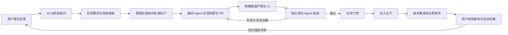
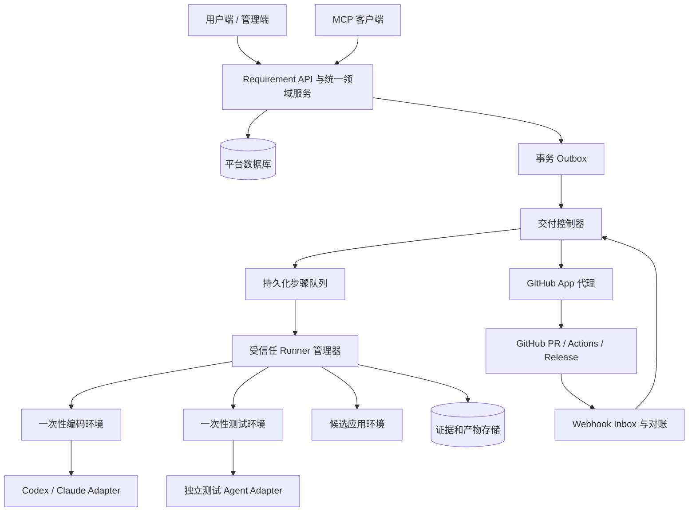

# TrailSnap Agent-native 需求与交付平台设计

> 状态：建议方案，供评审与分期实施；不代表功能已经实现。
> 日期：2026-09-12。
> 范围：以 `package/requirement-platform` 为控制中心，连接用户反馈、需求分析、编码、独立验证、合并和发布。
> 与旧文档关系：保留 `doc/ai_requirement_delivery_platform_design.md` 作为首期历史设计，本方案扩展其后续交付能力。
> 调研边界：现状依据本地仓库代码；线上地址本次未能通过网页工具读取，未核验生产部署版本。外部接口依据文中官方资料。

## 1. 核心建议

把平台建设为“规格、任务、证据、决策”的统一管理中心。用户描述问题，管理员决定做什么；编码 Agent 根据已批准规格工作；独立测试 Agent 根据验收标准验证；确定性的控制器根据实际证据推进状态。

核心交付链为：



建议第一期实现“管理员批准 → 自动编码 → PR → 独立测试 → 管理员合并”。随后接入发布编排；观察质量稳定后，才对明确范围的低风险任务开放策略自动合并。

需要先确定的五条设计原则：

1. **需求以平台批准的规格为准。** GitHub Issue 是公开开发镜像，聊天记录是背景材料，二者都不能偷偷替换规格。
2. **Agent 返回的是成果和证据。** “实现完成”“测试通过”的自然语言不能直接赋予合并或发布资格。
3. **所有交付记录绑定版本。** 规格、代码 SHA、测试计划、数据集、模型和镜像必须可以追溯。
4. **编码和验收分别执行。** 新会话、新工作目录、独立测试依据；是否使用不同厂商模型是可配置优化。
5. **合并、发布、部署分别记录。** 对自托管软件，发布可下载版本不等于用户实例已经升级。

## 2. 现有基础与需要改变的地方

| 领域 | 本地代码已经具备 | 本方案需要补齐 |
|---|---|---|
| 用户反馈 | 分类、预期/实际行为、复现步骤、环境、附件、公开/私密、编辑历史 | 结构化追问、逐题答复、附件处理状态、确认后的问题摘要 |
| AI 分析 | `services.py` 内规则兜底和兼容模型调用；`TriageReport` 保存需求版本 | 有来源的证据、严格 Schema、产品知识、代码版本、分诊质量评估 |
| 分析展示 | `RequirementDetail.vue` 主要展示 `summary` 或 `recommendation` | 用户版分析卡片、管理员决策信息、澄清记录和验收标准 |
| 版本计划 | `ReleaseBatch`、条目快照、范围锁定、交付状态 | 执行规格、依赖图、实际 PR/测试/产物关联 |
| Agent 接口 | HTTP MCP、独立令牌与作用域 | 任务领取、心跳、成果上报、提问和运行恢复 |
| 后台任务 | `BackgroundJob`、幂等键、租约、失败重试 | 原子领取、续租、过期写入拦截、外部动作恢复 |
| GitHub | Issue/Milestone 同步、签名校验、Webhook 去重、PR 关联 | Checks/Actions/Release 事实采集、周期对账、严格合并门禁 |
| 测试 | 统一 PowerShell 入口、pytest、Playwright、Docker、独立照片仓库 | 需求级验收映射、候选环境、不可变数据集、独立测试证据 |
| 发布 | 产品构建工作流与发布 Skill；需求平台独立工作流 | 可恢复的发布任务、产物完整性门禁、部署和回滚记录 |

当前实现中应优先处理的语义与可靠性问题：

- `analyze_requirement()` 的模型输入主要是需求快照与文本查重候选，没有实际接入产品知识、代码证据和附件内容。规则兜底的 `confidence` 实际近似字段完整度，不能解释成正确率。
- 分诊目前解析 JSON 后主要检查是否为对象，尚不是完整的字段和枚举校验。完成分析后直接设为 `pending_review`，需要增加需求修订与当前状态守卫，防止迟到任务覆盖人工决定。
- 查重是最近 200 条记录上的文本相似度，只适合作为候选召回；不能等同于语义查重或自动重复判决。
- REST 和 MCP 存在各自执行状态变更的路径。后续所有入口必须调用同一领域服务，避免网页守门而 MCP 绕过。
- 当前关联 PR 合并会自动把需求设为 `closed`；Issue 关闭也能影响平台状态。新模式应记录“实现已合并”，发布验证完成后才标记“已发布”。
- 当前 Worker 是先查询再更新任务，固定 15 分钟租约；增加多个 Runner 前必须改为原子领取，并增加心跳、执行代次和取消机制。
- `tests/README.md` 仍描述 PR 默认 `p0`，但当前 `.github/workflows/tests.yml` 的实际选择是非手动触发运行 `full`。实施时统一文档与工作流，不能把旧文档当实际门禁。
- E2E 当前构建 server/frontend，但拉取 `trailsnap-ai:master`；照片 checkout 未在该步骤固定数据集提交。验收前必须冻结镜像和数据版本。
- Compose 使用固定项目名和默认端口，启动/清理脚本也没有传递任务级项目名，不能直接扩展为同一主机多 PR 并行。

## 3. 用户与管理员如何使用

### 3.1 用户提交：先允许表达，再逐步完善

首屏只要求“反馈类型、标题、发生了什么/希望解决什么”。允许截图、粘贴日志，并明确附件可见范围。其他字段按类型渐进展开，保留普通表单编辑能力。

| 类型 | 优先收集 | 进一步追问 | 不应要求用户提供 |
|---|---|---|---|
| Bug | 实际行为、预期行为、版本、操作步骤 | 发生频率、设备/部署方式、报错、最小样本、是否升级后出现 | 根因、代码位置、解决算法 |
| 新功能 | 使用场景、目标用户、现有困难、期望结果 | 使用频率、影响范围、替代办法、范围边界 | 技术设计、商业价值打分 |
| 改进建议 | 当前体验、具体不便、理想体验 | 操作前后对比、移动端/桌面端、可接受折中 | 完整 PRD 或测试代码 |

从 TrailSnap 内打开反馈入口时，建议自动带入版本、客户端类型、系统、语言、部署类型及请求关联 ID，由用户确认后提交。默认不采集完整本地路径、GPS、账户信息或整份系统日志。

用户提交后立即获得编号。AI 在后台分析；模型不可用时显示“已收到，等待进一步分析”，不阻止保存。

追问每轮最多 3 个最关键的问题，每个问题保存：`question_id`、对应字段、为什么需要、是否阻塞实现、建议选项、答案与来源。允许选择“不确定”，不反复强迫用户补同一项。

建议自动追问最多 2 轮；仍不清楚则交给管理员或安排复现调查任务。这是初始产品策略，可配置，不是硬性算法限制。

例如“导入照片后地图不显示”：

- “照片详情中能否看到经纬度？”用于区分缺少 GPS 与地图渲染问题。
- “所有照片都这样，还是只发生在某一相机拍摄的照片？”用于缩小范围。
- “可以提供一张不含敏感位置的示例照片，或只提供相关 EXIF 字段吗？”提供最低必要数据路径。

关键目标是让用户看见平台正在缩小问题范围，而不是接受一串专业术语审问。

### 3.2 用户可见的 AI 分析

需求详情展示五个区块：

| 区块 | 示例内容 |
|---|---|
| 我们理解的问题 | “照片已导入，但地图页没有展示具有位置信息的照片。” |
| 已确认的信息 | 版本、客户端、影响范围；每项标记用户提供或系统检测 |
| 还需要的信息 | 两个待答问题，直接内联回答，显示是否影响继续处理 |
| 可能相关的反馈 | 有权限查看的相似需求；说明相同点与差异 |
| 下一步 | “等待你补充样本”“等待维护者审核”“已安排到某版本” |

“AI 初步判断”与“管理员决定”分开展示。用户可以纠正摘要，纠正会产生新修订。无需让每位用户批准完整技术规格；涉及用户意图歧义时请其确认，最终实施范围由管理员批准。

完整度使用“已具备 / 待补充 / 不适用”清单；不要展示伪精确的“必要性 86 分”。不公开成本估算、内部安全细节、私密需求标题或原始执行日志。

被暂缓时解释具体原因、现有替代办法和重新评估条件，例如“目前可通过自定义规则完成；如果多位用户反馈无法配置，再评估内置入口”。AI 不能自动承诺发布时间。

### 3.3 管理员工作台

建议保留现有需求列表，增加以下页面或详情页签：

- **待处理队列**：缺信息、待审核、重复候选、用户新回复。
- **规格工作台**：原文与规格并排、未解决问题、验收标准、修订差异、批准按钮。
- **开发候选池**：价值依据、复杂度区间、风险、依赖、目标版本。
- **执行中心**：当前步骤、耗时、Agent、消耗、阻塞原因、取消/恢复/接管。
- **验收中心**：验收标准逐条结果、CI、截图/Trace、预览入口、失败重现。
- **版本中心**：范围、已合并项、未交付项、安装包/镜像、发布和回滚记录。

管理员点击“开始实现”时确认的是具体规格版本、仓库、分支基线、执行器、预算与权限范围。一次批准覆盖该范围内编码、提交 PR 和测试，不在每个普通命令前反复确认。扩大需求范围、提升风险、合并和正式发布按策略单独处理。

## 4. AI 分析依据与质量控制

### 4.1 证据来源

| 来源 | 作用 | 版本与访问约束 |
|---|---|---|
| 用户原文、问答、附件 | 确认场景和预期 | 绑定需求修订；继承可见性 |
| 产品原则、路线图、功能目录 | 判断是否符合产品方向、是否已有功能 | 管理员维护的版本化知识 |
| 官方文档和变更日志 | 判断版本差异、提供已知解决办法 | 记录文档路径/URL、版本、更新时间 |
| 历史需求、已解决问题 | 发现重复和回归 | 检索先按 ACL 过滤，不能只在输出阶段遮挡 |
| 仓库源码、测试、架构约束 | 评估可行性与影响区域 | 固定 repo commit；只读研究环境 |
| 授权的诊断和复现结果 | 验证用户报告 | 数据最小化、脱敏、记录环境与结果 |

分成两级分析，控制成本和误判：

1. **提交分诊**：规则检查、相似候选、产品知识、澄清问题；不启动可执行代码环境。
2. **采纳前研究**：管理员选中或疑似高影响问题后，启动只读代码研究或隔离复现任务，形成可实施规格。

第一阶段可以使用关系查询、全文检索和关键词；只有实际召回效果不足时再加入向量检索。不需要先搭建大规模知识图谱。

### 4.2 报告结构

建议新增严格的 `TriageReportV2` Schema，字段包括：

```text
schema_version、requirement_revision、context_bundle_id
problem_summary、category
confirmed_facts[]、hypotheses[]、evidence_refs[]
completeness_items[]、blocking_questions[]、nonblocking_questions[]
duplicate_candidates[]（相同点、差异、依据）
value_assessment（用户影响、频率、替代方案、产品匹配度）
feasibility、affected_components[]、risks[]、effort_range
recommended_disposition、acceptance_draft[]
model、prompt_version、knowledge_revision、generated_at、fallback_reason
```

事实与假设分开。例如“用户说所有 HEIC 文件都失败”是报告事实；“可能与解码依赖缺失有关”是假设，必须附复现计划，不能直接写成根因。

必要性评估采用解释性维度：影响与频率、是否存在替代方案、维护成本、产品边界、数据损失风险。管理员按这些证据决定优先级。票数作为一项信号，严重的数据丢失问题不能因反馈人数少而降为低优先级。

建议输出决策只有：继续澄清、待审核、疑似重复、建议暂缓、建议不采纳。正式采纳、拒绝和标记重复均保留人工决定。

### 4.3 防止过期分析覆盖新信息

将内容修订与状态并发版本分开：

- `content_revision`：原文、问答、附件变更时增加。
- `state_version`：状态/调度变更时增加，用于乐观锁。
- `spec_revision`：批准的实施规格单独递增。

分析任务入队时固定输入快照，完成后检查内容修订是否仍匹配。旧报告可保留用于历史，但标记 `superseded`，不能改变当前审核状态。附件 OCR 或诊断后补到达时同样触发有节流的新分析。

### 4.4 分诊评测

先整理一批人工标注的历史需求作为评测集，覆盖完整/缺失信息、真实重复/相似但不同、已有能力、版本错误、提示注入和私密数据。

评估重点是：关键缺失项召回、无依据结论比例、无效追问比例、重复候选准确性、管理员改写量、每单轮次和成本。每次换模型、Prompt 或知识版本均跑同一评测集；不能只比较模型自报置信度。

## 5. 防止编码理解偏差：可执行的需求规格

### 5.1 规格是交付合同

新增 `RequirementSpec`，经批准后内容不可变；改动产生新版本，旧版本保留。`ReleaseBatchItem.requirement_snapshot` 可保留用于版本视图，但引用具体 `spec_id` 才是执行依据。

规格至少包含：

| 字段 | 要解决的问题 |
|---|---|
| 问题、用户场景、目标 | 为什么要做 |
| 已确认事实与参考资料 | 判断依据是什么 |
| 范围与非目标 | 这次做到哪里 |
| 行为规则与边界 | 空值、失败、权限、移动端等如何处理 |
| 编号化验收标准 | 怎样证明完成 |
| 测试数据与环境要求 | 用什么输入验证 |
| 仓库、目标分支、基线 SHA | 在哪份代码上实现 |
| 约束与风险 | API 格式、主题、暗色、迁移、兼容性 |
| 依赖及拆分关系 | 依赖哪些规格或任务 |
| 发布与回滚要求 | 如何交付给用户、如何撤回 |
| 未决问题和明确假设 | 哪里仍存在不确定性 |

建议规格示例，以下仅用于解释设计，不代表当前真实需求或已确定的产品行为：

```yaml
schema_version: 1
requirement_number: REQ-EXAMPLE
spec_revision: 3
target:
  repository: LC044/TrailSnap
  branch: master
  base_sha: "<批准时的完整提交 SHA>"
problem: 照片列表切换筛选条件后仍保留上一次的选择状态
goal: 切换筛选条件时清空选择，避免用户误操作不可见照片
in_scope:
  - 当前照片列表的筛选切换与选择状态
out_of_scope:
  - 修改批量删除语义
  - 增加跨页面保留选择的设置
acceptance:
  - id: AC-01
    given: 当前列表已经选中两张照片
    when: 用户更改相册筛选条件
    then: 新列表加载完成后选中数为零，批量操作栏隐藏
    verification: e2e
    dataset: selection-basic@1
  - id: AC-02
    given: 当前列表存在选择且发起筛选切换
    when: 新列表请求失败
    then: 不得对不可见照片执行批量操作，并显示可重试错误
    verification: e2e-fault-injection
  - id: AC-03
    given: 用户只是刷新当前筛选的数据
    when: 筛选条件未改变
    then: 选择状态遵循本规格批准的刷新规则
    verification: integration
blocking_questions:
  - AC-03 刷新时保留仍存在照片的选择，还是全部清空？
status: draft
```

该示例故意保留一个阻塞问题，展示系统应该阻止它直接进入编码。管理员补齐 AC-03 后才能批准。避免把“符合预期”“体验更好”作为无法判定的验收标准。

### 5.2 开始编码前的对齐检查

编码 Agent 领取任务后先提交结构化 `ImplementationPlan`：

- 用自己的话复述目标与范围。
- 每条验收标准对应的改动与自测计划。
- 预计影响模块、依赖和迁移。
- 发现的歧义、冲突、超范围事项。

控制器检查验收覆盖是否完整、有无阻塞问题、是否触及受控路径。简单且与批准规格一致的计划可直接继续；出现新产品决策则进入 `needs_clarification`，由管理员答复并修订规格。

规格冻结后，新增用户评论不能直接作为执行指令。由规格维护者区分补充背景与范围变化。范围变化时终止旧授权、生成新执行代次，使旧测试与旧批准失效。

### 5.3 执行上下文包

平台按角色生成 Context Bundle：规格 JSON/Markdown、原始证据引用、批准假设、目标 SHA、相关架构说明、适用 AGENTS/Skills 版本、测试入口、数据集 manifest、预算与工具权限。

上下文包保存摘要哈希，附件按授权短链接读取；不能把令牌、生产环境文件或所有历史聊天塞入 Prompt。

“编码成功”需要提交 PR 链接、实际 head SHA、变更清单、验收覆盖、自测结果和已知限制。控制器回查 GitHub 校验仓库、目标分支、关联和 SHA 后，才进入下一步。

## 6. 总体架构与 Agent 接入

### 6.1 控制面与执行面



建议继续使用现有 FastAPI + SQLAlchemy + Vue，增加独立交付控制器与 Runner 服务。短期用数据库持久化步骤即可，不为第一个闭环引入新的重型工作流基础设施。

SQLite 可以承担单实例过渡试点，但在并发执行、心跳和事件写入前迁移 PostgreSQL。平台数据库独立于 TrailSnap 照片数据库；不能复用业务库的权限或照片卷。

日志、截图、视频、Trace、安装包引用放对象存储或带 ACL 的文件服务。数据库只存元数据、hash 和关联。Runner 主动连接平台领取任务，不要求公网访问开发者电脑。

### 6.2 各执行角色

| 角色 | 输入 | 输出 | 可执行操作 |
|---|---|---|---|
| 分诊 Agent | 用户反馈、受限产品知识 | 分诊报告、澄清问题 | 只读分析；无 Shell/Git 写权限 |
| 规格研究 Agent | 候选需求、只读代码 | 规格草稿、实现与测试风险 | 只读研究；复现通过专用隔离任务 |
| 编码 Agent | 已批准规格与上下文包 | 改动、PR 草稿材料、自测证据 | 任务工作区读写和受限命令 |
| 测试 Agent | 冻结验收规格、候选 SHA、环境 | 验收用例、执行结果、缺陷证据 | 测试工作区写入、隔离环境访问；无产品分支写权限 |
| 审查 Agent | 规格、diff、测试报告 | 可行动的代码审查意见 | 只读；作为额外信号 |
| 发布助手 | 已合并版本范围与产物 | Release Notes、升级/回滚说明 | 准备材料；正式发布由受控步骤执行 |

不必每个需求都启动六个 Agent。初始固定三类：分诊、编码、独立测试；规格研究按复杂度启动，发布内容按版本批次合并生成。

### 6.3 供应商适配层

定义平台自己的接口：`start(run_spec)`、`stream_events(cursor)`、`submit_answer(question_id)`、`cancel()`、`collect_result()`；另报告是否支持 `resume`，不强迫所有供应商拥有相同会话行为。

Codex MVP 可通过 `codex exec --json` 收集事件，并用 `--output-schema` 约束最终结果；需要长会话、持续交互与批准处理时再使用 App Server 的本地协议。事件结束只表示执行结束，仍需平台验证成果。[Codex 非交互执行](https://learn.chatgpt.com/docs/non-interactive-mode)、[Codex App Server](https://learn.chatgpt.com/docs/app-server)。

Claude 接入可采用 Python/TypeScript Agent SDK；现有 Python 后端也可驱动独立 Python Runner。平台托管执行以 API 凭据作为默认接入方式，凭据由执行基础设施管理。[Claude Agent SDK](https://code.claude.com/docs/en/agent-sdk/overview)。

现有 MCP 的职责是让外部 Agent 使用平台业务能力。它不负责替平台启动任意开发机器上的 Codex。需要同时建设 Runner 调度协议和 Agent Adapter，二者与 MCP 共用领域服务。

允许两种使用方式并存：管理员手动在本地 Agent 中领取任务，或者平台调度远程 Runner 自动执行。两种方式都必须提交相同规格、SHA 和证据，人工跑过不能只手动勾选“测试成功”。

### 6.4 Runner 可靠性

每次执行包含 `run_id`、`step_id`、`attempt_id`、`execution_epoch`、`lease_token`。建议心跳 20 秒、租约 90 秒作为初始值，通过运行数据调优。

- 使用原子条件更新或 PostgreSQL 行锁领取，不能先读后无条件写。
- 心跳续租只对当前 owner 和 epoch 有效。
- 失联后先查询执行器/外部操作状态；确认停止或完成后再安排重试。
- 旧租约回调与写入必须拒绝；外部动作只能经验证租约的代理发起。
- 管理员取消立即撤销后续动作授权，再停止进程、收集证据并清理环境。
- 启动器不能依赖 SSH 会话持续存在；进程和环境由 Runner 监督。
- 时间、模型费用、磁盘、环境数量都有任务级与全局上限；不可用供应商报告无法获得的用量字段，不伪造精确费用。

## 7. 如何测试新功能与判定正确性

### 7.1 测试依据必须早于实现结果

在批准规格后生成并锁定验收计划，至少明确每条 AC 的输入、操作、预期结果和证据类型。测试 Agent 首先读取用户场景与规格来设计测试，再阅读代码分析额外风险，减少只验证实现者思路的问题。

编码 Agent 可以写单元和回归测试；独立测试 Agent 可新增验收脚本，但不能随意修改产品代码、降低阈值、跳过失败用例或重写预期。确需修改验收标准时走规格修订。

独立性首先来自独立会话、工作区、凭据和验收依据。不同模型可以减少一部分共同偏差，但不能替代可重复执行的断言。

### 7.2 测试矩阵

| 层次 | 验证内容 | 推荐执行方式 | 放行要求 |
|---|---|---|---|
| 静态/构建 | 类型、构建、依赖、明显秘密泄露 | 原有构建与检查流程 | 所有必需项通过 |
| 单元 | 修改涉及的业务规则、异常边界 | pytest / 前端测试 | 对新增关键行为有有效断言 |
| 集成 | BaseResponse、权限、数据库、事务、worker | 真实 PostgreSQL/pgvector 和测试 API | 请求成功之外校验数据与副作用 |
| E2E | 用户操作链路、移动端/桌面端、主题/暗色、键盘操作 | Playwright | 编号 AC 覆盖并产生证据 |
| AI 集成 | 服务接口、超时、降级、任务流水线 | 固定 mock + 小规模真实模型 | mock 与真实模型结果分别列出 |
| 模型效果 | OCR、人脸、搜索质量 | 冻结标注集与指标脚本 | 预先约定阈值及基线回归限制 |
| 数据/迁移 | 升级、约束、删除与回滚条件 | 旧版本库快照升级测试 | 数据一致性断言；破坏操作额外审核 |
| 平台安装 | 特定 OS 安装、升级、启动 | Windows/macOS/Linux 对应 Runner | 按需求实际影响的平台验收 |

继续复用 `tests/scripts/run-tests.ps1`。其具体执行命令由受信任测试计划固定，例如 `-Layer e2e -Level full -Mode docker -EnvFile <任务配置>`。目前 PR 的 full 门禁应保留；未来按变更选择子集必须先证明选择规则覆盖充分，再修改策略。

新增需求测试与固定回归测试同时运行。不能用“现有 200 项通过”替代“这次新增功能被验证”，也不能用新增一项通过替代既有回归。

### 7.3 判定正确性的四类依据

1. **确定性断言**：API 的 `code == 0`、数据内容、数据库变化、文件 hash、权限隔离、任务最终状态。
2. **行为不变量**：重复导入不增加重复记录；取消任务不继续修改文件；普通用户看不到其他用户私密照片。
3. **人工维护的标注或批准的规范**：EXIF 预期值、OCR 标注文本、相关搜索结果集合、组件设计规范。
4. **受限的视觉/语义评估**：AI 检查遮挡、布局、文案等辅助信号；不能单凭一句“看起来正确”放行关键逻辑。

Bug 应尽量在基线复现失败，在候选版本通过相同测试，记录“失败 → 通过”的原因。新功能在基线不存在可以作为预期差异，但必须区分“功能缺失”与“环境没有启动”。

对 AI 输出不强求字节完全一致：OCR 可使用字符错误率，语义搜索使用 Recall@K，人脸使用已标注同人/异人对的错误率。具体阈值必须由当前模型基线和业务要求确定，本方案不凭空设一个通用正确率。

模型版本、权重 hash、推理参数、硬件与数据集版本必须记录。效果测试不能套用普通 CI 只处理少量照片的限额然后报告全数据集通过。

### 7.4 证据报告与门禁

```json
{
  "schema_version": 1,
  "spec_id": "spec-example-r3",
  "candidate": {
    "pr_number": 123,
    "head_sha": "<full-sha>",
    "base_sha": "<full-sha>",
    "tested_sha": "<候选或合并候选 SHA>",
    "source_tree_hash": "<tree-hash>"
  },
  "environment_id": "env-example",
  "dataset_manifest_hash": "sha256:...",
  "test_plan_hash": "sha256:...",
  "results": [
    {
      "criterion_id": "AC-01",
      "case_id": "selection-filter-reset",
      "status": "passed",
      "expected": "选中数为 0，批量操作栏隐藏",
      "actual": "选中数为 0，批量操作栏隐藏",
      "evidence_ids": ["artifact-example-trace", "artifact-example-api"]
    }
  ],
  "summary": {"passed": 1, "failed": 0, "skipped": 0, "blocked": 0},
  "verdict": "passed"
}
```

这是协议示例而非真实测试结果。`verdict` 由可信结果汇总器根据报告、实际退出码与产物推导；不直接信任 Agent 填写。

每个用例支持 `passed / failed / blocked / skipped / inconclusive`。必需用例数量为零、缺产物、全部跳过、授权不够或数据未准备好都不能判通过。平台展示覆盖率时明确分母是批准的必需 AC/用例数，不是本次恰好执行的数量。

固定验收套件和汇总器版本放在受保护的测试基线中，由可信工作流注入；PR 中新增的测试是候选输入。涉及工作流、测试基线、阈值或门禁的修改必须单独审核，防止“改掉测试所以全绿”。

### 7.5 失败后的修复循环

测试失败 → 生成缺陷记录（AC、环境、步骤、预期/实际、证据、失败分类）→ 原编码任务追加修复 attempt → 新 head SHA → 重新构建和测试。

初始建议最多 2 次自动修复。相同原因连续出现、预算耗尽或需要改规格时交给管理员。基础设施失败进入环境恢复队列，不默认要求 Agent 修改业务代码。

偶发失败可以重跑诊断，但保留所有尝试。关键用例重跑通过仍应按策略判定是否需要人工检查，不能抹掉首次失败。

## 8. 测试部署与照片数据导入

### 8.1 三类环境

| 环境 | 目的 | 生命周期与数据 |
|---|---|---|
| 编码环境 | 修改、自测 | 每个任务/attempt 隔离；无生产数据 |
| 验收/预览环境 | 固定候选验证、人工体验 | 每个候选 SHA 独立；受控测试数据 |
| 预发布/生产环境 | 版本级验证、正式交付 | 稳定环境、受控迁移、独立部署凭据 |

小规模可使用一台控制服务器和一台独立 Runner 主机。公网需求 API 不持有 Docker socket，不直接执行用户反馈里的命令。运行候选代码的环境不能访问控制面数据库、GitHub App 私钥或发布凭据。

可信 Runner 管理器负责创建 VM/容器和网络。Docker 工作区隔离不足以单独承担所有不可信代码安全边界；公共 PR 或高权限依赖构建使用一次性 VM/加强隔离的执行环境。

### 8.2 每个候选的部署步骤

1. 控制器固定规格版本、head SHA、base SHA、测试计划与数据 manifest。
2. 构建涉及的组件；若修改 AI 代码，必须构建候选 AI 镜像。未修改组件可复用已验证的精确 digest。
3. 保存 `EnvironmentManifest`，记录所有镜像 digest、源码、迁移版本、配置 hash、模型/数据版本。
4. 为候选分配唯一项目名、网络、数据库、数据目录和临时凭据。
5. 执行 Alembic 迁移，启动 API、独立 worker 与 AI 服务。
6. 完成健康检查、worker 心跳和所需模型预热；区分存活、可接请求和业务就绪。
7. 导入测试数据并验证准备结果，失败则环境 `not_ready`。
8. 运行固定回归、新增验收和探索性检查，上传证据。
9. 提供受鉴权的预览地址及到期时间；显示候选版本，避免误认正式环境。
10. 运行结束清理或按策略短期保留；独立定时清理器回收因进程崩溃遗留的环境。

预览域名可设计为 `pr-123-<sha>.preview.trailsnap.cn`，是建议规划，当前不假定 DNS、证书或主机已配置。默认仅管理员/测试者可访问；用户试用通过限定期限、权限与数据范围的邀请入口。

### 8.3 改造现有测试脚本

增加可贯穿 `run-tests`、`services-up`、`services-down` 的 `RunId / ProjectName / ArtifactsDir / ComposeOverride` 参数，或等价的配置字段。所有 Compose 调用显式传 `-p`，覆盖现有固定项目名；所有端口、照片副本、报告、Playwright 状态目录均按 run 隔离。

保留 EnvFile 为每次运行配置的唯一入口，由模板生成任务专属文件。避免多个任务共同覆写仓库里的 `tests/.env.test`。清理只能针对该 run 的资源，不能在共享主机运行全局按端口清理。

第一阶段如果尚未完成这些改造，只允许单环境串行执行，不能声称支持多 PR 并行。

### 8.4 图片数据分层

现有 `LC044/trailsnap-test-photos` 继续作为基础夹具源，但补上固定提交、文件 hash 与标注 manifest。

| 数据集 | 用途 | 建议内容 |
|---|---|---|
| smoke | 最小启动与浏览 | 少量标准 JPEG/PNG；明确照片记录预期数 |
| functional | 功能断言 | EXIF/GPS、时区、旋转、HEIC、视频、实况照片、重复、中文路径、损坏文件 |
| model-golden | 模型效果 | 获授权的 OCR/人脸/搜索样本与人工标注 |
| regression | 已修复 Bug 防回归 | 每条已采纳缺陷对应的最小化案例 |
| scale | 性能与稳定性 | 可再生成的规模数据；固定生成器、种子与硬件基线 |

数据 manifest 至少包括 `dataset_id/version`、仓库 SHA、文件 SHA-256、逻辑 sample ID、格式、预期字段、预期任务、授权/可见范围、保留策略和标注修订。

不要把文件数量直接等同于照片记录数量：实况照片可能由多个文件组成，损坏文件可能应被跳过。按 sample 的业务语义声明预期结果。

### 8.5 导入路径

基础验收沿用现有真实业务链：

```text
拉取固定版本照片仓库 → 校验 manifest → 建立任务副本
→ 创建测试账户 → POST /settings/directories 注册目录
→ 等待自动产生的 SCAN_FOLDER → 等待该扫描引发的必需后续任务
→ 校验照片记录、字段与索引 → 写入 DatasetPreparationReport
→ 开始验收
```

现有注册目录已自动触发扫描，不应再创建第二次相同扫描。轮询按 run、目录和任务关联判断就绪，不能只看任意一个扫描成功或固定等待 30 秒。

改造准备 helper 保存该 run 的照片逻辑 ID 到数据库 ID 映射，以文件 hash/相对路径匹配，不依赖不稳定自增 ID。重置数据库后必须失效旧准备缓存。

原始夹具保持只读；整理、重命名、删除等用例使用可写副本，并校验副本内容和源数据 hash。用于测试“上传”的需求必须实际走上传接口/UI；不能仅通过目录扫描就宣称上传能力通过。

大数据量回归可复用已标注数据库快照提高速度，但扫描/上传功能本身必须从原始文件走全链路。数据库快照绑定 schema 和基线版本。

### 8.6 用户附件进入测试集

“上传用于反馈”与“允许长期用于回归测试”分别授权。原始照片可能包含人脸、位置和个人路径，默认不写入公开照片仓库或公开 GitHub Issue。

经审核将样本最小化、去除无关敏感内容，再提议加入受控数据集。若 Bug 恰好由 GPS/EXIF/特殊编码引起，不能删掉关键字段；优先构造保持问题特征的替代样本，并重新验证能够复现。

对象存储对原图、截图和日志分别控制访问；转码、OCR 和附件解析在受限环境执行，限制解压尺寸、处理时长和输出体积。用户撤销使用许可后从后续数据版本移除，并保留不含内容的审计记录。

## 9. 状态如何流转

### 9.1 拆分业务状态和执行状态

不要让 `Requirement.status` 同时承担审核、机器运行、版本发布三个职责。建议分别维护：

| 对象 | 状态 |
|---|---|
| 需求审核 | `submitted → triaging → needs_information / pending_review → accepted`；旁路为 `deferred / rejected / duplicate / withdrawn` |
| 规格 | `draft → in_review → approved → superseded`；撤销批准记事件 |
| 交付任务 | `queued → planning → implementing → pr_open → verifying → ready_to_merge → merged`；返工为 `changes_requested` |
| 执行 attempt | `queued / running / waiting_input / succeeded / failed / cancelled / timed_out` |
| 版本 | `planning → scope_locked → integrating → validating → ready → publishing → released` |
| 环境部署 | `pending → provisioning → ready → deploying → healthy / failed → rolled_back / expired` |

任务和版本另存 `blocked_reason`、`paused_at`，不把所有异常都塞进一个模糊的“失败”。审批已通过而 Runner 排队时，用户应看见“已安排，等待开始”。

初期可以保留现有 `status` 字段作为兼容展示投影，逐渐停止直接写入。`closed` 保留为行政结案并配 `resolution`（已发布、重复、撤回、不采纳等），不承担唯一完成含义。

### 9.2 关键转换的守卫

| 事件 | 发起方 | 必要条件 | 产生结果 |
|---|---|---|---|
| 提交反馈 | 用户 | 字段/配额/可见性校验 | 新修订、分诊任务 |
| 分诊完成 | 控制器 | 报告合法、输入版本仍有效 | 报告与待办；不替管理员采纳 |
| 批准实现 | 管理员 | 规格冻结、阻塞问题解决、风险/预算明确 | 授权与唯一交付任务 |
| 领取任务 | Runner | 能力匹配、原子租约、依赖完成 | 执行 attempt |
| 提交 PR | 代码发布代理 | 当前授权、分支/仓库/SHA/规格匹配 | PR 关联与 CI 跟踪 |
| 开始验收 | 控制器 | 必需基础 CI 通过、环境和数据就绪 | 独立测试 attempt |
| 验收通过 | 结果汇总器 | 全部必需 AC 通过、无缺失证据、测试版本有效 | `ready_to_merge` |
| 合并 | 管理员或合并策略 | 所有受信任门禁通过、候选仍最新、批准有效 | GitHub 合并请求与后续核验 |
| PR 合并回调 | 同步控制器 | 回查实际 merged、目标分支正确 | `merged`，不设 `released` |
| 版本发布完成 | 发布控制器 | 精确标签/范围、测试、全部目标产物与必要部署验证 | `released`、用户通知 |

任一 head SHA、关键 base SHA、规格、数据集或测试计划变化，都应重新计算门禁。历史报告保留，但显示过期。

### 9.3 用户端状态投影

用户无需理解 attempt/lease，显示：已收到、待补充、审核中、已采纳、已安排、开发中、验证中、修复中、已合并待发布、已发布，以及不采纳/重复/已撤回。

同一需求允许拆成多个 DeliveryTask；每项绑定验收子集。只有全部必需子任务交付才显示完整完成。一个 PR 可服务多个需求，使用显式关联表，不根据标题猜测。

大型需求按父需求—子需求拆分，优先让每个 PR 单独可验收。跨分支依赖明确记录 DAG；MVP 让依赖合并后再启动后续任务，暂不做复杂堆叠分支自动重排。

### 9.4 撤回、返工和发布后问题

- 实现前撤回：取消未运行任务。
- 执行中撤回：停止后续动作，保留已产生的 PR，由管理员决定关闭。
- 合并后撤回：不能假装代码消失；管理员安排回滚或新需求。
- PR 未合并关闭：任务标记取消/待重新计划，不是已完成。
- 部分 PR 合并：只更新对应交付项。
- 发布后发现回归：新建关联缺陷和影响版本，保留历史发布事实。
- 版本部分产物失败：版本为发布异常，不能将所有需求标为已发布；可显式调整发布渠道范围并重新批准。

## 10. 数据模型与接口

### 10.1 最小新增实体

| 实体 | 核心字段与用途 |
|---|---|
| `ClarificationThread/Message` | 问题 ID、答案、作者、可见性、关联修订；支持结构化与自然语言回复 |
| `RequirementSpec` | requirement_id、revision、schema_version、内容 JSON、hash、批准者、状态 |
| `AcceptanceCriterion` | spec_id、稳定 AC ID、输入/行为/预期、必需性、验证方式 |
| `ContextBundle` | spec_id、repo SHA、知识版本、角色、文档和附件引用、hash |
| `DeliveryTask` | requirement/spec、repo、target_branch、state、dependency_ids、risk、budget、state_version |
| `AgentRun/StepAttempt` | 角色、provider、model、版本、租约、epoch、步骤、会话引用、用量、退出原因 |
| `Runner` | 能力、OS、模型/GPU、并发上限、心跳、可信级别 |
| `PullRequestLink` | repo_id、PR number、head/base/merge SHA、task_id、覆盖 AC；联合唯一约束 |
| `TestPlan/TestRun/CaseResult` | 规格、候选、数据、测试基线；逐 AC 状态和证据 |
| `DatasetVersion` | manifest、来源提交、授权范围、hash、标注修订 |
| `Environment` | run、项目名、镜像 digest、配置 hash、数据、URL、TTL、状态 |
| `Artifact` | URI、hash、MIME、size、producer、访问级别、保留期 |
| `Approval` | 操作、对象、spec/head/policy hash、批准者、有效期、撤销记录 |
| `ReleaseExecution/Deployment` | batch、渠道、标签 SHA、产物 manifest、测试、部署与回滚 |
| `DomainEvent/Outbox/Inbox` | 事件版本、幂等键、来源、处理进度、失败、下次重试 |

不必第一期把所有 JSON 都拆成表，但需要检索、关系约束和状态机的核心实体应独立存储。既有审核和审计表继续使用，并补齐 Agent 身份：令牌创建人、执行 Agent、run_id 分别记录，不能把 Agent 操作都归为管理员本人。

### 10.2 领域命令

建议新增以下 REST 能力，并通过 MCP 映射成语义一致的工具：

| 操作 | REST 示例 | MCP 示例 |
|---|---|---|
| 获取执行规格 | `GET /api/requirements/{id}/specs/{revision}` | `get_requirement_spec` |
| 提交澄清答复 | `POST /api/requirements/{id}/clarifications/{qid}/answers` | `answer_clarification` |
| 批准规格 | `POST /api/specs/{id}/approve` | 仅获授权管理客户端可用 |
| 创建交付任务 | `POST /api/delivery-tasks` | `create_delivery_task` |
| 原子领取 | `POST /api/agent-runs/claim` | `claim_delivery_task` |
| 心跳 | `POST /api/agent-runs/{id}/heartbeat` | `heartbeat_run` |
| 申请澄清 | `POST /api/agent-runs/{id}/questions` | `request_clarification` |
| 上报成果 | `POST /api/agent-runs/{id}/results` | `submit_run_result` |
| 关联 PR | `POST /api/delivery-tasks/{id}/pull-requests` | `link_pull_request` |
| 提交验收证据 | `POST /api/test-runs/{id}/results` | `submit_test_evidence` |
| 查询/取消执行 | `GET /api/agent-runs/{id}`、`POST .../cancel` | `get_run`、`cancel_run` |
| 查看事件 | `GET /api/events?cursor=...`，支持 SSE | `list_events` |

这些接口均为拟新增，响应沿用 `BaseResponse` 的 `{code, msg, data}`。异步创建返回 202 和任务 ID；并发冲突 HTTP 409，响应仍按统一格式提供当前版本和允许动作。

写入需携带 `Idempotency-Key`、`expected_state_version`，运行写入还要 `attempt_id/lease_token`。服务端检查对象归属、角色、状态转换和版本，不能仅凭 scope 字符串授权任意对象。

Agent 令牌新增 `tasks:claim`、`runs:write`、`artifacts:write`、`tests:submit` 等细粒度作用域，并限制项目、任务、角色与有效期。编码令牌不再需要宽泛的 `requirements:review`。

所有入口统一调用 `RequirementService / DeliveryService / VerificationService / ReleaseService`，废弃由普通 Agent 任意设置状态的交付路径。旧工具保留兼容期，但不允许绕过新任务的门禁。

## 11. GitHub 和平台如何同步

### 11.1 每类数据只有一个权威来源

| 数据 | 权威来源 | 其他位置用途 |
|---|---|---|
| 用户原文、澄清、规格、采纳、交付授权 | 平台 | Issue/PR 展示受控摘要和链接 |
| 代码、PR head/base、是否合并 | GitHub | 平台缓存并对账 |
| Actions 实际运行、退出结果 | GitHub Actions | 平台汇总，不能只看 Agent 自报 |
| 独立测试详细结果 | 受信任测试执行与证据存储 | GitHub Check 展示结论与链接 |
| 批次范围与发布授权 | 平台 | Milestone 镜像 |
| 标签、Release、上传附件 | GitHub/制品仓库 | 平台保存 manifest 和验证结果 |
| 部署健康状态 | 部署控制器 | 平台展示环境和版本 |

Issue 正文保留平台管理区块和人工讨论区块；同步只修改管理区块。GitHub 上手工调整标签可变成平台待处理事件，但不能直接推进新交付任务的审核、合并或发布状态。

PR 保留 REQ 编号、规格版本、平台链接和现有 `Closes #...` 约定。`Closes` 只用于 GitHub Issue 的闭环；平台不能再把 Issue 已关闭等价成需求已发布。需同步修改提交 Skill、MCP 工具说明和旧 webhook 测试。

私密需求默认不向公开 GitHub 镜像原文或附件。若必须关联公开 Issue，先生成经批准的脱敏开发摘要；私密细节通过受限上下文包传递。

### 11.2 事件处理机制

业务事务同时更新对象、追加 DomainEvent 和写 Outbox。提交后 worker 执行外部动作。Webhook 先验签、校验仓库/安装来源、持久化 Inbox 并尽快响应，再异步处理。

GitHub 官方建议使用 secret 验证事件、采用异步队列并在服务恢复后重投遗漏事件。本平台额外用 delivery ID 去重和定期对账补全事实。[GitHub Webhook 最佳实践](https://docs.github.com/en/webhooks/using-webhooks/best-practices-for-using-webhooks)。

事件建议包含：`event_id`、`event_type`、`schema_version`、`aggregate_id/version`、`correlation_id`、`causation_id`、`occurred_at`、`source`、`payload`。语义事件使用 `spec.approved`、`pr.synchronized`、`verification.completed`、`release.verified`，不要解析聊天文字推进状态。

不追求跨平台“恰好一次”。采用至少一次投递、幂等副作用和事实核对：

- 同一需求规格的首次交付任务由唯一键去重。
- 分支命名包含 `codex/req-<number>-<task>`；创建 PR 超时后先按 repo/head branch 查回已有 PR，再决定重试。
- Issue 管理区写平台稳定标识；同步超时后先核对关联与远端标识，不能盲目再创建。
- 发布前检查标签/Release/产物是否已经存在、是否属于本次 manifest；存在但不匹配则停止，不能强行移动标签。
- 重试使用指数退避和抖动；长期失败进入人工处理队列。

### 11.3 乱序、漏事件与回写循环

- Webhook 只是触发核对的信号。迟到的旧 PR 事件不能覆盖当前 head；关键转换先回查最新 PR/Check。
- 建议活跃 PR 每 2–5 分钟对账，发布中的版本更频繁；按规模与 API 限流调整。
- 回写带来源和对象版本，只同步有实际变化的字段；避免“平台改标签 → Webhook → 平台再改标签”的循环。
- 平台显示 `last_synced_at` 与同步异常，不能把“暂时查询失败”显示为 CI 通过或需求失败。
- SSE 只是通知通道，支持 cursor/Last-Event-ID 恢复；重新连接后也可读取资源当前快照。

## 12. 合并与发布门禁

### 12.1 合并条件

合并控制器计算以下条件的交集：

```text
规格与执行授权有效
AND PR 属于批准仓库/目标分支且 head 未变化
AND 所有规定 CI 和必需测试完整通过
AND 独立验收覆盖全部必需 AC
AND 测试绑定当前候选、数据集和测试基线
AND 无未解决的阻塞审查意见
AND 风险等级对应的人工/策略批准有效
AND 最新主干组合验证通过
```

由受信任 GitHub App 发布独立 `delivery-gate` Check，并配置分支保护/规则集限定所需检查来源。普通编码/测试 Agent 无发布成功 Check 或直接合并权限。GitHub API 的权限粒度不足以只允许某一分支时，由代理严格限制 repo/ref/操作，再配分支规则。

首期采用串行合并：固定当前目标分支，更新候选组合并重新验证，合并前重新核对 base/head；变化则重试。需要同时约束其他写入者遵循分支规则，不能只依赖平台内互斥锁。

GitHub Merge Queue 不是所有仓库都可用。若仓库所有权/套餐支持，可后续接入并增加 `merge_group` 工作流；否则使用上述串行方案。[GitHub Merge Queue](https://docs.github.com/en/repositories/configuring-branches-and-merges-in-your-repository/configuring-pull-request-merges/managing-a-merge-queue)。

测试记录同时保存 head、base 和实际 tested SHA。不能拿 PR head 测试与 GitHub 的临时合并提交 SHA 直接混比；squash/rebase 后保存代码树对应关系，版本发布仍对最终主干/标签产物验证。

### 12.2 发布流程

沿用现有版本批次和产品发布流程，拆为可恢复步骤：

1. 锁定版本范围，确认所有必需交付项已合并。
2. 生成版本准备 PR：版本号、官网变更日志、客户端更新清单、发布说明。
3. 合并版本准备 PR 后，固定最终 release commit，执行版本集成验证与所需完整测试。
4. 创建草稿发布计划，展示目标标签、渠道、预期镜像/附件、变更、升级和回滚要求。
5. 管理员批准具体 release commit 与 manifest。
6. 受控发布步骤创建标签/Release 并驱动构建；监控标签对应工作流，按实际工作流推导必需产物。
7. 校验源码关联、镜像 digest、附件大小/hash/上传状态和目标平台完整性；对最终产物进行安装/启动或部署冒烟。
8. 需要在线部署的渠道执行预发布、迁移和健康验证，再推广正式环境。
9. 全部批准渠道达到发布条件后，平台标记版本 `released`，回写需求并通知关注者。

MVP 可保留现有“创建 Release 后触发构建”的方式，但平台必须显示“发布中”，不能把 Release 创建成功直接作为完成。后续可改为先准备草稿和产物、验收完成再公开，具体调整要与现有标签触发工作流一起验证。

CI 产物与正式产物不同或重新构建时，不能直接沿用旧测试结论；必须补最终产物验证。能复用同一已验证镜像 digest 的部署优先推广同一制品。

版本包含多个分批合并的需求时，不能只相加各 PR 的通过结果。合并之间可能相互影响，最终版本集成验证必不可少。

产品继续使用 `vX.Y.Z`，需求平台继续使用 `requirement-v*`，独立版本与发布范围。仓库发布 Skill 可作为步骤规范来源，但应将核心校验提取成确定性脚本，避免仅靠 Agent 阅读长文档执行。

### 12.3 回滚

每次发布保存上一可用制品、数据库迁移状态、备份记录和恢复步骤。数据库采用先扩展后收缩的兼容迁移策略，能切回旧应用时优先只回滚应用。

破坏性迁移不能承诺靠切换镜像恢复。应明确停写窗口、备份恢复与发布后新数据处理方式；可能丢失新写入时由管理员决定。删除或整理用户原始照片的变更必须有额外恢复设计与人工验证。

平台自身升级时先停止新任务领取、等待或安全暂停活跃任务，再迁移和滚动更新。控制器重启后从数据库恢复状态、核对 GitHub 和环境，避免重复合并/发布。

## 13. 权限与自进化边界

用户反馈、附件、仓库内容和 Agent 输出都可能包含不可信指令。信任边界必须体现在执行权限上，不能只在 Prompt 中写“不要执行危险命令”。

| 主体 | 授权边界 |
|---|---|
| 用户 | 提交、补充和查看有权限的需求；不能从评论中下发运行命令 |
| 分诊服务 | 只读授权内容，输出报告 |
| 编码执行环境 | 指定任务工作区；无主干、Release、生产和其他任务凭据 |
| 测试执行环境 | 指定候选与测试数据；无合并与发布权 |
| GitHub 代理 | 短期安装凭据、严格仓库/ref/动作校验、审计 |
| 合并控制器 | 只对门禁满足且批准有效的候选合并 |
| 发布控制器 | 只对已批准 release manifest 发布和部署 |
| 管理员 | 决定范围和风险例外；例外不能伪装为测试通过 |

PR 构建/依赖脚本不接触高权限凭据；模型调用可经任务级受限代理，避免长期 API Key 被候选测试读取。高权限工作流不检出并执行未受信任候选代码，制品名/路径/摘要也必须验证。[GitHub Actions 安全实践](https://docs.github.com/en/actions/reference/security/secure-use)。

GitHub 代理建议使用 GitHub App。不能假定用工作流默认 `GITHUB_TOKEN` 推送或创建 PR 后所有下游流水线都会自动运行；需按当前事件规则配置 App 或显式 dispatch，并实际等待 run 出现与结束，缺少 run 是阻塞状态。[GitHub 工作流触发规则](https://docs.github.com/en/actions/how-tos/write-workflows/choose-when-workflows-run/trigger-a-workflow)。

对于“平台开发自身”，将审批策略、Runner 权限、生产凭据注入、门禁代码、受保护测试基线和工作流设为受控路径。本次候选不得使用自己修改的策略批准自己；沿用当前稳定策略验证，并由管理员审核策略升级，下一次任务才使用新版。

## 14. 建议代码落点

以下为拟新增/拆分结构，不要求一次重构现有所有文件：

```text
package/requirement-platform/server/requirement_platform/
  api/                 逐步拆分现有 main.py
  domain/
    requirements.py    审核、修订、澄清
    specifications.py  规格与批准
    delivery.py        交付状态机和守卫
    verification.py    证据归集与门禁
    releases.py        批次与发布
  contracts/           JSON Schema / Pydantic
  orchestration/       持久化步骤、租约、取消和恢复
  integrations/github/ App 代理、Webhook、Outbox、对账
  knowledge/           产品知识、检索与证据引用

package/requirement-platform/runner/
  adapters/            codex、claude
  environments/        创建、准备、清理
  protocol/            领取、心跳、事件、结果
  policies/            受信任命令与能力约束

package/requirement-platform/web/src/
  views/               需求、规格、执行、验收、版本
  components/          追问卡片、AC 结果表、执行时间线

tests/
  contracts/           规格/数据/报告示例及 Schema 检查
  acceptance/          需求级验收的入口或映射
  scripts/             复用现有入口，增加任务隔离参数
```

所有模型变更配 Alembic 迁移。既有 `Base.metadata.create_all` 不能代替已部署数据库的列、索引与约束迁移。

从 SQLite 迁 PostgreSQL 需专项验证 SQLite 专用索引语义，例如唯一 owner 的部分索引，及 JSON、时区、外键、ID/编号和幂等约束。维护窗口冻结写入、导出导入、校验计数和关键 hash、切换配置；回退前处理切换后新写入，不能简单覆盖旧文件。

## 15. 实施顺序与可验收交付

估算假设：一名熟悉仓库的维护者，Agent 辅助开发，能使用测试主机和模型 API。以下按工作量区间规划，并行、现有测试稳定性和基础设施采购会改变日历时间，不是承诺排期。

| 阶段 | 内容 | 独立验收标准 | 建议工作量 |
|---|---|---|---|
| A 规格闭环 | 结构化追问、Triage V2、规格修订、AC、统一状态服务 | 一个含糊反馈可形成批准规格；迟到分诊不覆盖决定；用户能纠正摘要 | 1–2 周 |
| B 手动 Agent 接入 | Context Bundle、任务/attempt、MCP 领取与上报、PR 关联、事件/幂等 | 手动启动的 Codex/Claude 使用同一协议交付；重复领取/上报不重复创建动作 | 1–2 周 |
| C 自动编码 | 独立 Runner、一个 Adapter、隔离与取消、预算、GitHub 代理 | 管理员一次批准后自动产出 PR；失联/重启可恢复；无主干写权限 | 1–2 周 |
| D 独立验收 | 数据 manifest、候选环境、脚本隔离、TestPlan/Run、证据门禁、修复循环 | 固定 SHA 的真实新功能由独立会话验收；失败能复现；旧结果不放行新提交 | 2–3 周 |
| E 交付同步与发布 | Checks/对账、串行合并、版本集成、Release/产物与部署状态 | PR 合并显示待发布；必需附件失败时不完成；重放不重复发布 | 1–2 周 |
| F 稳定性和有限自动化 | 第二厂商、多 Runner、低风险自动合并、质量观测 | 按明确策略自动化，并可暂停/接管；达到预设质量目标 | 按试点数据决定 |

A–D 是可用闭环，建议按约 5–9 周工作量准备；完整受控发布约 6–11 周。不要以“Prompt 已写好”作为任何阶段完成标准。

### 15.1 推荐拆分为可独立评审的 PR

1. 抽取统一状态服务，补乐观锁、内容版本与旧分诊守卫。
2. Triage V2 与追问/答复页面，明确事实、假设和用户摘要。
3. RequirementSpec、AC、批准与 Context Bundle。
4. DeliveryTask/AgentRun、原子领取、心跳、取消与语义化 MCP。
5. PostgreSQL 迁移验证与事件 Outbox/Inbox/对账基础。
6. 一个 Runner 和 Codex Adapter，受控推送与 PR 关联。
7. 测试脚本 run 隔离、镜像固定、照片 manifest 和就绪报告。
8. 独立测试 Agent、逐 AC 证据和失败分类。
9. `delivery-gate`、过期结果失效、有限修复循环和串行合并。
10. 新旧需求状态兼容、Webhook/Issue 关闭语义、Skill/MCP 文案迁移。
11. 版本发布任务、产物 manifest、最终验证与通知。
12. 第二供应商与质量评测、策略升级。

这些是后续实施拆分建议，本次不创建需求单、分支、PR 或发布。

### 15.2 试点选择

先选三类已有测试数据能覆盖的小任务：一个明确可复现的 Bug、一个前端交互改进、一个小型后端/API 功能。要求有明确 AC，尽量不涉及迁移和原始照片删除。

首次验收应包括故障演练，而非只演示顺利路径：

- 同一开始按钮连续点击，只产生一个有效任务。
- 编码 Runner 断线重启，不重复推送或创建 PR。
- 需求在分诊中被编辑，旧报告不能改变新状态。
- PR 推送新提交后，上一轮成功 Check 不再满足平台门禁。
- Webhook 重复/乱序/漏投后，对账恢复正确状态。
- AI 模型权重下载失败，显示环境阻塞而不是业务测试成功。
- 照片扫描失败或实际测试数为零，阻止进入可合并。
- 修改门禁或降低测试阈值的候选触发受控路径审核。
- 发布缺一个必需目标产物，版本保持发布异常。
- 私密附件不会进入公开 Issue、日志或预览数据。

## 16. 迁移与运营指标

### 16.1 兼容迁移

采用“先增加实体与新流程开关，后迁移入口，最后淘汰旧写入”的方式：

1. 保留历史需求与状态，不改变既有用户记录。
2. 仅新批准的任务启用交付状态机。
3. 旧 `candidate/scheduled/developing/testing` 可映射展示，但缺规格/证据的历史任务标记 `legacy_unverified`，不能虚构已经验收。
4. 对已有 `closed` 需求按审核理由、合并和 Release 证据分类。没有发布证据就保留历史结案事实，待人工核对。
5. REST、MCP、GitHub Webhook 和版本条目全部切换统一命令与投影后，再禁用任意交付状态修改。
6. 同步更新 README、旧设计文档的后续说明、提交/发布 Skills 与接口兼容说明。

### 16.2 质量与成本指标

优先记录：提交到可实现规格的时间、补充信息完成率、管理员改写比例、首次验收通过率、重开率、发布后回归率、每个成功交付的费用、无效重试量、环境准备失败率、Webhook 延迟与对账差异。

统计分母包含取消、失败和人工接管任务，避免只报告成功样本。按任务类型、风险和供应商分组，不直接用模型排名决定所有任务路由。

“自进化”的长期反馈进入三类资产：新增回归测试、脱敏数据样本、产品知识/规格模板。Agent 可提出改进 PR，但模型、Prompt、门禁和策略升级都要通过独立评测和审核，不能自行扩大权限或降低完成标准。

通知默认只在需要补充、采纳/安排、等待管理员、合并待发布、正式发布和异常需要行动时发送。内部状态细节留在执行时间线，避免每个心跳或工具调用都打扰用户。

## 17. 本方案实施前需要落实的配置项

可以先按本方案默认值推进，以下在进入相应阶段前落实即可：

| 配置项 | 建议默认 |
|---|---|
| 初期范围 | 仅 TrailSnap 仓库，保留以后增加 Project 的边界 |
| 首个执行器 | Codex 非交互 Adapter；Claude 通过同一协议后续接入 |
| 自动化权限 | 自动分析/编码/测试；人工决定采纳、合并和正式发布 |
| 执行资源 | 独立 Linux Runner；涉及桌面端时增加对应 OS 能力 |
| 并发 | 初始编码 1、验收 1；环境隔离验收后再放开 |
| 修复策略 | 最多 2 次自动修复，超限或同因重复转人工 |
| 数据 | 固定版本基础夹具；私密样本单独授权和保管 |
| 预览 | 管理员可访问，默认 24 小时，失败现场可手工延期 |
| 证据保留 | 成功运行 30 天、失败 90 天作为初值；发布 manifest 长期保存 |
| 模型预算 | 按任务与每日设置可配置硬上限；正式数值由试点实际费用确定 |
| 合并 | 串行、精确候选校验；不假定 Merge Queue 已可用 |

最终成功标准是：任意一个已发布需求，都能从用户原话追溯到批准规格、实现 PR、独立验收证据和可获得的版本产物；发生错误时能明确定位失败步骤、停止自动动作并恢复工作。
