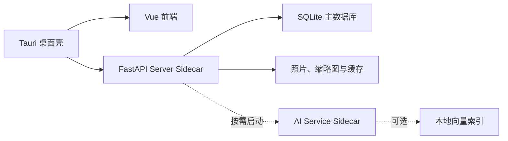

# TrailSnap 桌面安装包技术路线

> 文档状态：初步可行性方案
>
> 更新时间：2026-08-09
>
> 适用范围：Windows 优先，后续评估 macOS 与 Linux

## 1. 背景与目标

TrailSnap 当前采用前后端及 AI 服务分离架构：

- 前端：Vue 3 + TypeScript + Vite；
- 主后端：FastAPI + SQLAlchemy + Alembic；
- 主数据库：PostgreSQL + pgvector；
- AI 服务：FastAPI + InsightFace、RapidOCR、ONNX Runtime、CLIP 等；
- 部署方式：Docker Compose 启动 PostgreSQL、Server、AI 和 Frontend。

桌面化的目标不是简单地在 Web 页面外包一层窗口，而是提供接近普通桌面软件的体验：

- 用户通过安装程序完成安装，不需要自行安装 Python、Node.js、Docker 或数据库；
- 应用可自动启动和关闭所需的本地进程；
- 照片、数据库、缩略图、模型和日志使用稳定的用户数据目录；
- 支持离线浏览和管理本地照片；
- 应用升级时保留用户数据，并能安全升级数据库结构；
- AI 能力可以根据安装包体积和硬件条件按需提供。

## 2. 总体结论

TrailSnap 打包成桌面安装包在技术上可行，生成安装包本身不要求将 PostgreSQL 替换为 SQLite。

但如果目标是面向普通用户的一键安装、离线运行和零数据库运维，推荐形成以下产品分层：

1. **服务端完整版**继续使用 PostgreSQL + pgvector，保留多用户、完整 AI 和远程访问能力；
2. **桌面 Lite 版**使用 SQLite，优先提供照片管理核心能力；
3. OCR、人脸识别、图片分类、CLIP 等作为可选 AI 扩展包按需下载；
4. 桌面版不在首个版本中追求与服务端完整版 100% 功能对等。

推荐的长期方案是“同一套业务代码 + 两种运行配置”，而不是彻底将整个项目迁移到 SQLite。

## 3. 路线对比

| 路线 | 数据库形态 | 改造量 | 用户体验 | 功能完整度 | 适用阶段 |
| --- | --- | ---: | --- | --- | --- |
| 桌面壳连接现有服务端 | 远程 PostgreSQL | 小 | 仍需配置服务端 | 完整 | 快速验证桌面 UI |
| 桌面壳管理本地 Docker | Docker PostgreSQL | 小到中 | 依赖 Docker，启动较重 | 完整 | 开发者预览，不适合普通用户 |
| 桌面壳内嵌 PostgreSQL | 随应用分发 PostgreSQL + pgvector | 中 | 无需 Docker，但数据库升级复杂 | 接近完整 | 高级版或企业版候选 |
| 桌面壳 + SQLite | 单文件本地数据库 | 大 | 一键安装、离线、零配置 | 首版需要裁剪 | 推荐的消费级桌面路线 |

### 3.1 不推荐将 Docker 作为正式桌面依赖

虽然复用现有 Docker Compose 是改造量最小的方式，但它会要求用户安装并运行 Docker Desktop，同时带来虚拟化、权限、端口占用、磁盘空间和后台资源消耗问题。这种方式可以用于内部验证，不应作为普通用户桌面版的最终交付形态。

### 3.2 内嵌 PostgreSQL 的特点

内嵌 PostgreSQL 并不是真正的嵌入式数据库。本质上仍然需要随应用分发 PostgreSQL 二进制、初始化数据目录、启动独立数据库进程，并管理端口、认证、备份、崩溃恢复和大版本升级。

它的主要优势是能最大限度复用现有 pgvector 逻辑；主要风险包括：

- 安装包体积增加；
- Windows、macOS、Linux 需要分别准备 PostgreSQL 和 pgvector 构建产物；
- PostgreSQL 与 pgvector 存在 ABI 和版本匹配问题；
- 应用卸载、覆盖安装和自动升级时必须保护数据库目录；
- 数据库进程异常退出、端口冲突和杀毒软件拦截需要专门处理。

因此，该路线适合作为保留全部功能的高级方案，不适合作为首个消费级桌面版本。

## 4. 推荐桌面架构



### 4.1 桌面壳

长期推荐使用 Tauri 2：

- 可以直接复用现有 Vue/Vite 前端；
- Windows 可生成 NSIS Setup 或 MSI；
- 默认使用系统 WebView2，桌面壳本身体积较小；
- 支持将 FastAPI 打包产物作为 Sidecar 管理；
- 后续可以接入系统托盘、文件选择器、自动更新和原生菜单。

如果目标是尽快得到第一个可安装原型，可以先使用 Electron Forge。Electron 对 Node.js 子进程管理更直接，但会随应用分发 Chromium，基础安装包和运行内存更大。由于完整 AI 包本身可能远大于桌面壳，最终仍应通过实际构建结果决定 Tauri 与 Electron，而不是只比较壳层体积。

### 4.2 前端加载方式

现有前端大量使用 `/api/*` 相对地址，开发模式由 Vite 将 `/api` 重写到 FastAPI。桌面版不宜直接用 `file://` 打开构建后的 `index.html`，否则会遇到 API 地址、SSE、跨域和前端路由刷新问题。

推荐由本地 Server 同时提供：

- Vue 构建后的静态文件；
- `/api` 到现有 FastAPI 路由的同源入口；
- Vue Router 的 history fallback；
- 媒体文件、缩略图和 SSE 接口。

桌面壳启动时先选择空闲本地端口，生成一次性启动令牌，启动 Server，等待健康检查通过，再加载本地页面。Server 仅监听 `127.0.0.1`，不监听 `0.0.0.0`。

### 4.3 Python Sidecar

主后端推荐使用 PyInstaller 或 Nuitka 打包。首选目录模式而不是单文件模式，原因是：

- Python 原生扩展和动态库较多；
- 单文件模式每次启动需要解压，启动较慢；
- ONNX、OpenCV、Pillow、HEIF 等依赖的动态库定位更难；
- 目录模式更利于增量升级和问题诊断。

桌面壳需要负责：

1. 启动 Server；
2. 捕获标准输出和错误日志；
3. 等待健康检查；
4. 应用退出时通知 Server 优雅停止；
5. 超时后再终止遗留 worker 和 AI 进程；
6. 检测上次异常退出并恢复未完成任务。

## 5. SQLite 迁移范围

SQLite 并不是修改数据库连接字符串即可完成。当前代码存在以下 PostgreSQL 绑定：

- 大部分 ORM 模型直接使用 PostgreSQL `UUID` 类型；
- 人脸、图片和智能相册使用三组 512 维 pgvector 字段；
- 人脸向量使用 PostgreSQL HNSW 索引；
- 智能相册、相似照片、年度报告和 Agent 直接在 SQL 中计算余弦距离；
- 启动脚本负责创建 PostgreSQL 数据库和启用 `vector` 扩展；
- 数据库连接池包含 psycopg2 keepalive 参数；
- 部分代码使用 PostgreSQL JSON 和日期函数；
- Railway 模块拥有独立的 PostgreSQL 初始化和数据同步逻辑；
- 现有 Alembic 历史迁移以 PostgreSQL 为主要目标。

### 5.1 数据类型适配

建立跨数据库类型层，避免业务模型直接导入 PostgreSQL 方言类型：

- UUID：PostgreSQL 使用原生 UUID，SQLite 使用 `CHAR(36)` 或 16 字节 BLOB；
- JSON：统一通过 SQLAlchemy JSON 类型和仓储方法访问；
- Enum：避免依赖 PostgreSQL 原生枚举的创建和删除语义；
- Vector：从普通 ORM 字段中抽离，由独立的向量存储接口管理。

### 5.2 查询适配

需要替换或封装以下查询：

- `func.extract` 等日期聚合；
- PostgreSQL JSON 路径函数；
- pgvector 的 `cosine_distance`；
- PostgreSQL 专属索引参数；
- 迁移中的类型强制转换和 PostgreSQL DDL。

不建议在 CRUD 文件中到处增加 `if dialect == "sqlite"`。应建立数据库能力接口，例如：

- `PhotoRepository`；
- `TaskRepository`；
- `VectorRepository`；
- `StatsQueryService`。

优先封装两种数据库差异最大的查询，其余普通 SQLAlchemy CRUD 可以继续复用。

### 5.3 并发和任务系统

SQLite 支持多个读取者，但同一时刻只有一个写入者。桌面版需要：

- 启用 WAL；
- 启用 `foreign_keys=ON`；
- 设置合理的 `busy_timeout`；
- 控制写事务长度；
- 将任务结果写入集中到单一写入队列；
- 避免 API 进程和 worker 中多个线程长时间同时写数据库；
- 为批量扫描、缩略图生成和 AI 结果保存增加背压。

可以保留任务的并行计算，但并行任务完成后应将数据库更新交给集中写入器，避免频繁出现 `database is locked`。

### 5.4 迁移策略

不建议要求现有所有 PostgreSQL 历史迁移都能在 SQLite 上执行。建议：

1. 服务端继续沿用当前 PostgreSQL Alembic 历史；
2. 桌面版建立 SQLite 初始基线迁移；
3. 基线之后的新结构变更同时维护 PostgreSQL 和 SQLite 路径；
4. 每次升级前自动备份 SQLite 文件；
5. 迁移失败时保留旧数据库并阻止应用继续写入；
6. 提供数据库完整性检查和恢复入口。

## 6. 向量能力处理方案

向量检索是 SQLite 化的主要边界，不建议在首版中直接寻找 pgvector 的完全等价替代品。

### 6.1 首版方案

桌面 Lite 首版关闭：

- CLIP 语义搜索；
- 智能相册；
- 视觉相似照片；
- 基于向量选择年度最佳照片；
- Agent 中依赖图片向量的工具。

### 6.2 后续方案

定义统一接口：

```text
upsert(photo_id, embedding)
delete(photo_id)
search(embedding, limit, filters)
rebuild()
health_check()
```

候选实现包括：

- SQLite BLOB + NumPy 暴力检索：实现简单，适合中小照片库和早期验证；
- hnswlib：本地近似最近邻索引，性能较好，但需要管理索引文件一致性；
- FAISS：能力成熟，但原生依赖和跨平台打包成本较高；
- LanceDB 或其他嵌入式向量库：接口友好，但需要评估版本稳定性和安装包体积；
- SQLite 向量扩展：部署简单的潜力较高，但正式采用前需要验证成熟度、平台构建和过滤能力。

主数据库仍然保存向量任务状态和模型版本，向量索引可以删除后重建，不作为唯一的数据来源。

## 7. 功能分层与裁剪建议

### 7.1 桌面 Lite 首版保留

- 本地照片目录选择、扫描与增量索引；
- 原图、视频、Live Photo 和缩略图预览；
- EXIF、拍摄时间、位置和基础地图；
- 普通相册、标签、时间线和文件夹视图；
- 文件名、路径、标签、位置等普通文本搜索；
- 回收站；
- MD5 重复照片检测；
- 重命名、目录整理、按文件名推断时间；
- 基础仪表盘和存储空间分析；
- 离线反向地理编码；
- 数据库备份、恢复和日志导出。

### 7.2 首版关闭或隐藏

- Railway 车次基础数据库和相关初始化流程；
- 多用户注册、用户管理和相册共享；
- Agent Token 和外部 Agent 接口；
- 本地 LLM、Agent 对话和朋友圈文案；
- CLIP 语义搜索、智能相册和情绪向量；
- 视觉相似照片；
- 年度报告中依赖向量、LLM 或完整票据数据的高级部分；
- GPU、OpenVINO 和多推理后端自动选择；
- 面向服务器部署的端口、远程数据库和网络管理设置。

不建议直接删除这些代码。应通过 `desktop_lite` 能力配置控制后端路由、导航菜单、任务类型和设置页面，保持服务端完整版不受影响。

### 7.3 可选 AI 扩展包

建议按依赖和模型拆分：

1. OCR 包；
2. 火车票与机票识别包；
3. 图片分类包；
4. 人脸识别包；
5. CLIP 和语义检索包；
6. 本地 LLM 包。

扩展包需要提供：

- 精确版本和文件校验值；
- 下载进度、暂停、重试和镜像源；
- 所需磁盘、内存和显存说明；
- 卸载模型但保留分析结果的能力；
- 模型升级后的索引重建提示；
- 完全离线的手动导入方式。

## 8. 单用户模式

桌面版不必立即删除现有用户和 `owner_id` 设计。推荐：

- 首次启动自动创建本地用户；
- 桌面壳持有随机生成的本地访问凭证；
- 前端自动登录，不显示登录和注册页面；
- 隐藏用户管理、Token 和分享功能；
- 数据库仍保留 `owner_id`，降低与服务端版分叉程度；
- 将来如需本地多资料库或云同步，可以复用现有所有权边界。

本地服务不能因为“只监听 localhost”就完全取消鉴权。恶意网页或本机其他进程仍可能访问固定端口，因此应使用随机端口、启动令牌、严格 CORS 和 Host 校验。

## 9. 数据目录设计

Windows 建议目录结构：

```text
%LOCALAPPDATA%\TrailSnap\
├── data\
│   ├── trailsnap.db
│   ├── backups\
│   └── rg_data\
├── cache\
│   ├── thumbnails\
│   └── temp\
├── models\
├── indexes\
├── logs\
└── config.json
```

原则：

- 安装目录只存放程序文件；
- 用户照片仍保留在用户选择的原目录，默认不复制；
- 数据库只保存文件路径、元数据和分析结果；
- 缩略图与向量索引属于可重建数据；
- 卸载程序默认不删除用户数据库、模型和缓存，提供明确复选项；
- 移动照片目录后提供路径重映射功能；
- 所有路径解析都不能依赖当前工作目录。

## 10. 安装、签名和更新

Windows 首版建议输出按用户安装的 NSIS `setup.exe`：

- 默认安装到用户目录，避免要求管理员权限；
- 创建开始菜单和桌面快捷方式；
- 检查或引导安装 WebView2；
- 安装后首次启动再初始化数据库和下载可选模型；
- 安装包只包含 CPU 基础运行时；
- GPU/OpenVINO 作为后续高级选项。

公开分发前需要 Windows 代码签名。否则 SmartScreen 和杀毒软件会显著影响用户信任，Python 打包产物、多进程启动和自更新程序也更容易触发误报。

自动更新需要分别处理：

- 桌面壳版本；
- Server Sidecar 版本；
- SQLite Schema 版本；
- AI Sidecar 版本；
- 模型和向量索引版本。

应用更新与模型更新应解耦，避免每次发布程序都重新下载数 GB 模型。

## 11. 主要困难和风险

按预期工作量和风险排序：

1. AI 模型、ONNX Runtime、InsightFace、OpenCV 等原生依赖的跨平台打包；
2. PostgreSQL UUID、pgvector 查询和 Alembic 迁移的 SQLite 适配；
3. SQLite 在多进程、多线程任务写入下的锁竞争；
4. 桌面壳、Server、worker、AI 和 LLM 子进程的完整生命周期；
5. 安装升级时的数据备份、Schema 迁移和失败回滚；
6. Windows 签名、SmartScreen、自动更新和杀毒软件误报；
7. HEIF、视频编码、GPU 和不同 CPU 指令集的机器兼容性；
8. Windows、macOS、Linux 分别构建、签名和回归测试；
9. 双数据库后端带来的长期测试和维护成本；
10. 模型授权、模型下载源稳定性和离线分发合规性。

## 12. 分阶段实施计划

### 阶段 0：桌面壳技术验证

目标：验证现有前端和服务可以在 Windows 安装包中运行。

- 创建 Tauri 或 Electron 最小壳；
- 打包 Vue 前端；
- 打包并启动 FastAPI Server；
- 暂时连接现有 PostgreSQL；
- 验证 `/api`、SSE、媒体预览和 Vue Router；
- 验证进程退出、日志、端口冲突和崩溃恢复；
- 生成未签名 NSIS 测试安装包。

预估：2～4 个开发日。

### 阶段 1：SQLite 桌面 Lite

目标：不依赖 Docker 和 PostgreSQL，完成照片管理核心闭环。

- 建立运行模式和能力开关；
- 实现跨数据库 UUID、JSON、Enum 类型；
- 建立 SQLite 基线迁移；
- 改造日期统计和任务 JSON 查询；
- 实现 SQLite WAL 和集中写入；
- 自动创建本地用户并自动登录；
- 关闭 Railway、Agent、向量和重型 AI；
- 实现数据目录、备份和升级回滚；
- 补充 SQLite 单元、集成和桌面 E2E 测试。

预估：3～6 周，取决于现有查询测试覆盖率。

### 阶段 2：AI 扩展包

目标：逐步恢复本地智能能力，不扩大基础安装包。

> 实现状态（2026-08-09）：已在继续使用 PostgreSQL 的桌面版本上完成首个
> `core-ai` CPU 扩展。扩展覆盖 OCR、票据识别和图片分类，具备跨平台独立构建、
> 版本清单、SHA-256 校验、在线断点下载、暂停/重试、离线导入、卸载和 Sidecar
> 按需启动/空闲退出。人脸、CLIP 与本地 LLM 仍属于后续阶段。

- 优先 OCR 和票据识别；
- 再加入图片分类；
- 完成模型下载、校验、版本和卸载管理；
- 实现按需启动 AI Sidecar；
- 验证不同 Windows 机器和 CPU 环境。

当前实现由桌面壳管理 AI 扩展：RapidOCR 随包提供的小型资源直接包含在运行时中，
图片分类和票据识别模型则由 AI 服务在运行时从 ModelScope 下载，并通过 Server
鉴权接口查看、重试和删除。GitHub Release 仅发布带 SHA-256 校验的扩展运行时，
不再重复发布独立模型包。

预估：2～4 周。

### 阶段 3：人脸与向量检索

目标：恢复人脸聚类、相似照片、语义搜索和智能相册。

- 落地 `VectorRepository`；
- 选择并验证本地向量索引；
- 实现主数据库与索引的一致性和重建；
- 迁移人脸聚类中的 pgvector 查询；
- 增加照片库规模基准测试；
- 评估高级年度报告和 Agent 能力。

预估：3～6 周。

### 阶段 4：正式分发

- Windows 代码签名；
- 自动更新；
- 安装、覆盖安装、降级和卸载测试；
- 异常断电和数据库损坏恢复测试；
- macOS/Linux 可行性验证；
- 用户文档、隐私说明和模型授权核查。

## 13. 验收指标

桌面 Lite 首版至少满足：

- 全新 Windows 环境无需安装 Docker、Python、Node.js 或 PostgreSQL；
- 安装后可以在 30 秒内进入可操作界面；
- 可以选择照片目录、完成扫描并浏览缩略图；
- 退出应用后不遗留 Server、worker 或 AI 进程；
- 应用升级不丢失数据库和照片目录配置；
- 10 万条照片元数据下常用分页和筛选保持可用；
- 批量扫描时 API 查询不频繁出现 SQLite 锁错误；
- 数据库迁移失败可以自动恢复到升级前备份；
- 所有程序端口仅监听本机；
- 日志中不记录用户密码、访问令牌和完整敏感配置。

AI 扩展应另行定义模型下载大小、首次推理时间、峰值内存、CPU/GPU 性能和索引重建时间指标。

## 14. 近期决策建议

在开始正式编码前，先完成阶段 0，并通过原型回答以下问题：

1. 使用 Tauri 还是 Electron；
2. Vue 静态资源由桌面壳加载，还是由 FastAPI 统一提供；
3. PyInstaller 与 Nuitka 哪个对现有依赖更稳定；
4. Windows 基础安装包的实际体积和首次启动时间；
5. Server 和 worker 能否在打包环境中稳定退出；
6. 是否将 SQLite Lite 定义为独立产品配置；
7. 首版是否完全不包含 AI，还是内置一个最小 OCR 能力。

当前推荐默认决策为：

- Windows 优先；
- Tauri 2 + NSIS；
- FastAPI 目录型 Sidecar；
- FastAPI 统一提供前端和 API；
- 桌面 Lite 使用 SQLite WAL；
- 服务端完整版继续使用 PostgreSQL + pgvector；
- 首版关闭向量、Agent、Railway 和重型 AI；
- AI 模型独立下载和升级。
