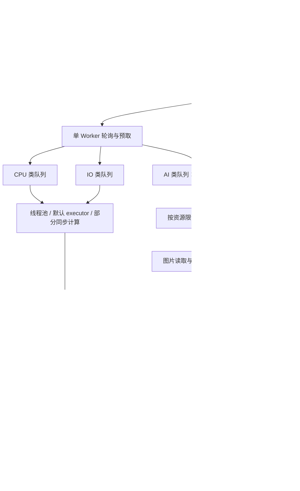

# 任务调度与执行性能扫描报告

日期：2026-10-10。扫描对象：当前工作区，HEAD 为 `d8abce23f4f4e8cec6794c49454901f30925322d`，**包含尚未提交的基础处理、AI 批处理及阶段调度优化**。本报告不代表该提交原始代码或已发布版本。

首次扫描进行了静态调用链、SQL 使用方式、执行池、限流、异常恢复和规模复杂度检查。后续讨论及首轮实现记录见下一节；问题清单保留扫描时的发现，已实施项不应继续视作当前未修复问题。未启动真实图库导入、全库重识别或 NAS/GPU 压力测试，不提供未经测量的端到端加速倍数。

## 讨论后的决策与首轮实现

### AI 调度方向

同一 AI 服务按任务优先级逐个类型执行，例如先分类、再人脸；同类型内部做有界批处理和请求并发，避免模型频繁切换。**不将按时间轮换模型或跨模型并行作为默认优化方案。** 提高接口请求并发时，同时调整每请求图片数和模型内部线程预算；先保证 batch 填满，再测量并发增加是否真正提高吞吐。

未来可评估按 AI 地址独立预算，以及阶段范围固定、长退避处理和交互请求等待策略。这些是独立设计议题，本轮不改变已有阶段排空规则。

### 统一业务结果写入的建议

建议后续将主要 AI 类型改为：并发执行单元只返回普通结果数据，由一个有界结果消费者批量写业务结果、处理标记、派生任务和任务完成状态，放在同一事务中。开始执行前的 PROCESSING 提交仍保留。队列不传 ORM 对象、Session 或解码后大图；未来刷新阈值需要同时限制照片数量、结果字节数和等待时间，失败重试或拆批隔离。

当前已经按 AI 批次提交，收益是进一步合并事务，而不是从逐条文本写入开始优化。举例：100 张照片、2 张一批、完成消费者约每 50 张刷新，理想情景下可从约 102 次提交减少到约 52 次；事务数量的减少不等于总耗时同比减少。应测完整持久化时间、锁/连接等待和端到端吞吐；慢 CPU 推理的 NAS 可能收益较小，GPU/远端 AI 加 SQLite 更可能受益。

本轮先修完成确认与执行生命周期；四类 AI 的业务结果暂仍由各批次独立会话写入，未实施全部业务结果集中写入重构。

### 本轮已实施

- 完成刷新失败向上抛出，重复投递会核对任务行并跳过已完成/已取消任务，消费者保留原批次、停止继续取结果并退避重试；结果队列上限 256 条。提交成功后才确认队列、更新完成计数、发布完成事件。人脸聚类派生任务与任务收尾共用事务，取消内部提前提交/吞掉错误。drain 判断包含正在刷新及已取出但未提交的结果。
- 批次线程拥有任务领取、策略执行、失败重试和关闭会话的完整生命周期；扫描、相似聚类、重建生成器、视觉编码等同步操作因此不再占用主调度循环。控制/完成写入与批次执行使用不同执行器，避免批次占满线程后无法回收。
- 取消/超时会等待实际线程工作结束后才释放资源槽。基础处理、缩略图的显式执行器作业使用同样的保护；批次内部默认执行器在 asyncio.run 关闭前排空。对不可中断的同步算法，这是一种软截止时间保护，不承诺硬终止；不提前重试仍在运行的线程。
- 预取改为两波“并发批次 × 每批图片数”，按任务类型/资源额度计算，最多 128 个排队任务 ID；选择候选类型时排除已预留任务。low 档分类/向量可获得完整 8 图批次，元数据可获得完整 16 图批次。
- 消费者取走队列、批次结束、完成提交、资源额度变化及 Worker 内部任务入队都会唤醒生产者；API 入队通过进程间 Event 唤醒，检查间隔 100ms；数据库轮询继续作为跨进程/外部写入的兜底。阶段排空逻辑保留。
- Worker 内同一存储卷的媒体作业共享额度：low/medium/high 默认 1/2/4；`task.disk_concurrency=0` 自动，1–16 可覆盖。覆盖扫描遍历、Live Photo 配对、基础处理、缩略图、MD5、元数据、主要 AI 图片读取/编码及整理/重命名；嵌套同卷读取复用槽位。基础处理和缩略图同时计算源卷与输出卷额度，跨卷复制/移动按一致顺序获取双方额度。查重待提交哈希作业数也按额度限制。

磁盘额度按 Windows drive/UNC share 或 POSIX device ID 区分，是进程内媒体作业额度；不能把同一设备的不同盘符识别成同一物理硬盘，也不覆盖独立 API 进程、AI 进程、定时 jobs 或数据库 WAL 刷盘。同步图像任务持有额度到处理结束，包含解码/编码计算，这是保守的媒体工作集控制；SSD/强桌面可通过显式配置提高额度，并在后续实测中再拆分读取与计算预算。

本轮没有 ORM 模型变化，不需要数据库迁移。

### 本轮验证

- 统一入口 `pwsh ./tests/scripts/run-tests.ps1 -Layer unit -Component server -Level smoke`：**2782 passed，48 deselected**。
- 调度/系统域冒烟：**431 passed，2399 deselected**；最终全量包含此后补充的重复投递保护。
- 新增 10 项真实 SQLite/执行器回归，覆盖完成提交失败后重试、完成事件与计数的提交边界、重复投递幂等、失败批次停止取新结果、超时线程结束前保留资源与 PROCESSING、同步领取/策略执行期间心跳、low 档三类完整批次、已预留高优先级不遮挡其他 CPU 类型、唤醒补货、同卷额度与异常释放。
- 修正既有策略工厂测试的全局注册表泄漏，保证后续任务执行测试使用真实策略；更新旧测试中已改变的预取和完成异常传播契约。
- 修改的 Python 源码编译检查与 `git diff --check` 通过。仅使用独立临时 SQLite 和测试配置；未执行真实 PostgreSQL 故障注入、完整桌面安装、NAS/HDD/GPU 基准或百万图库压力测试。

## 结论

当前系统已经具备独立 Worker、CPU/IO/AI 分类队列、小批处理、资源限流和批量落库，不是简单的单任务串行系统。但资源控制仍存在四个主要断点：

1. **事件循环仍会被同步数据库操作和部分重计算阻塞**，会同时拖慢任务领取、结果回收、压力监测和超时处理。
2. **调度批次、照片条数、线程数和模型内部线程预算不一致**：一部分链路吃不满批次，另一部分链路会在低并发配置下产生大量磁盘或推理线程。
3. **AI 按任务类型排空后切换是保留的默认策略**，用于减少模型驻留与重载。同阶段的 batch 填充、接口并发和端点预算需要优化；长退避、持续新增和人工请求等待是这一策略需要明确的边界。
4. **百万照片的主要风险是全库物化、任务膨胀与聚类规模**。只调并发或扩大数据库连接池不能解决。

推荐先修正阻塞、背压和完成确认，再做按部署形态区分的资源预算；十万至百万规模需要流式扫描、按需任务展开和有界聚类。现阶段不建议仅为了性能直接引入多 Worker 或外部消息队列。

## 当前执行链路与已有优化

- `scheduler.py` 的 APScheduler 负责定时触发；`task_worker.py` 负责照片任务实际排队和执行，两者不是同一层并发控制。
- TaskManager 启动独立后台进程，API 与任务事件循环隔离；Worker 内部有三类消费者、分类信号量和资源 AIMD 限流。
- 分类、OCR、人脸、向量的批次已经放到后台线程，各线程创建自己的数据库会话；主要结果写入按批次提交。不能再把“所有 OCR 文本逐条 commit”当作当前问题。
- 基础处理复用图像对象、批量预取数据库记录并保存 MD5；元数据批处理和完成结果刷新已经移出主事件循环。
- 预取有数量限制、任务执行前才标为 PROCESSING、瞬时错误有退避；AI 服务有接纳限制及原生推理线程预算。
- 人脸聚类已经拆分独立任务，并流式读取向量填入 float32 矩阵，减少了中间对象。其算法规模问题仍存在。
- 主后端自动档位已读取 cgroup CPU/内存限制；这项优化尚未贯穿 AI 默认线程数和运行期压力采样。

历史微基准见 [基础处理记录](E:/Project/TrailSnap/doc/performance/basic-processing-20261010/README.md) 和 [AI 写入记录](E:/Project/TrailSnap/doc/performance/ai-processing-20261010/README.md)。它们分别证明局部流水线和 SQLite 写入有收益，**不是本次重新实测，也未覆盖完整调度、NAS HDD、远端 GPU 或百万图库**。

## 并发的真实含义

设 C 为主后端识别的可用逻辑 CPU 数，以下均为静态上限；AIMD 开启时初始资源额度通常只有上限的一半向上取整。

| 档位 | Worker 显式线程池 | CPU 并发批次 | IO 并发批次 | AI 并发批次 | 分类/OCR/人脸/向量资源上限 |
|---|---:|---:|---:|---:|---|
| low | 4 | min(4, max(1, C÷4 向下取整)) | 2 | 2 | 1 / 1 / 1 / 1 |
| medium | 8 | min(8, max(1, C÷2 向下取整)) | 4 | 5 | 1 / 1 / 2 / 2 |
| high | 16 | min(16, max(1, C−1)) | 8 | 8 | 2 / 2 / 2 / 2 |

来源：[task_worker.py:273](E:/Project/TrailSnap/package/server/app/service/task_worker.py:273)。AI 阶段只运行一种任务类型，所以 high 的“AI 8”不等于 8 个分类请求；还受分类资源 2、AI 服务接纳门、批次大小和推理内部执行方式限制。本地视觉 LLM 的资源上限为 1，外部视觉 LLM 的 low/medium/high 上限为 1/2/4。

基础处理一批最多 4 张，在一个线程内顺序处理；分类和向量一批目标 8 张；元数据目标 16 张；OCR 为 1/1/2 张，人脸为 2/2/4 张。分类/向量有真正模型 batch，人脸/OCR 主要是请求内分图执行，不应把 HTTP 批次和张量 batch 混为一谈。

## 发现的问题

优先级含义：P1 为首先处理的可靠性、响应性或规模瓶颈；P2 为后续吞吐和可维护性优化。性能影响均需在对应设备测量。

### 1. P1：部分任务直接阻塞 Worker 事件循环

**证据**：[similar.py:31](E:/Project/TrailSnap/package/server/app/service/tasks/similar.py:31) 的异步 `process` 内没有任何 await，直接全量读向量、构建数组、执行 AgglomerativeClustering 和写库。`CPU` 分类只是配额，框架不会自动把任务放进进程或线程池。

扫描的 `_get_existing_files`、文件集合分组和批量建任务也在 Worker 事件循环执行；`REBUILD_METADATA` 生成器内是同步 OFFSET 查询/写入循环。视觉描述的图片编码和数据库处理也直接执行。

此外，[task_worker.py:812](E:/Project/TrailSnap/package/server/app/service/task_worker.py:812) 每批领取前查询任务、修改状态、commit，以及逐条失败/退避 commit，仍在主事件循环上。SQLite 遇到写锁或连接池等待时，会把等待放大为整个调度循环的停顿。

**影响**：已有任务不能及时回收，压力监测失真、调度空转或超时延后；同步聚类运行时，`wait_for` 的超时不能及时生效。API 是独立进程，不等于 API 事件循环会同步卡死，但仍会受到 CPU、磁盘与数据库竞争。

**建议**：将“领取/状态变更”和“业务计算”分别移入拥有独立会话的后台执行单元；纯 CPU 长作业考虑可终止的独立进程。不要跨线程传递活跃 ORM 会话，也不要只在同步大循环尾部补一个 sleep。

### 2. P1：预取按条数，执行按批次，产生供料不足和批量退化

**证据**：[task_worker.py:413](E:/Project/TrailSnap/package/server/app/service/task_worker.py:413) 的预取上限是 `category_consumer × 2`，比较对象却是照片任务条数；领取后才按 `get_chunk_size` 分批。

| 场景 | 一次空队列可领取的条数 | 配置的目标批大小 | 实际约束 |
|---|---:|---:|---|
| low 分类/向量 | 4 | 8 | 单批不可能达到 8 |
| low 元数据 | 4 | 16 | 单批不可能达到 16 |
| medium 元数据 | 8 | 16 | 单批不可能达到 16 |
| 4 核 low 基础处理 | 2 | 4 | 单批最多 2 |

队列满、所有候选已预留或无新派发时，生产者 sleep 从 1 秒退避到最多 10 秒；没有消费者“腾出容量”或新增任务的立即唤醒机制。有活跃批次时会重置退避，不能笼统说运行中每次都等 10 秒，但快速任务仍可能受 1 秒级补货间隔限制。

类型选择查询未排除 `reserved_task_ids`，随后取任务查询才排除。因此 CPU/IO 可能反复选到已预留的高优先级类型，拿不到新任务，却不尝试同类队列的其他可运行类型。

**建议**：用“资源可运行批次数 × 目标批大小 × 预取波数”估算供料，并叠加明确的条数/字节内存上限；容量变化和新任务触发唤醒，轮询作为兜底；选类型和取任务采用一致的可执行条件。先测批大小利用率和执行池空闲时间，不直接宣称存在固定吞吐上限。

### 3. P1：AI 全库阶段存在队头阻塞和饥饿

**证据**：[task_worker.py:640](E:/Project/TrailSnap/package/server/app/service/task_worker.py:640) 只要当前类型还有 PENDING、PROCESSING 或预留任务，就锁住阶段；阶段检查包含尚未到重试时间的 PENDING。实际取任务却排除未到重试时间的任务。

**确定的结果**：当前模型只剩退避任务时，其他模型仍不能运行；跨类型的交互优先级 10000 不能抢占已经开始的阶段。大量分类入队后，人脸、OCR、向量可能要等整阶段结束。持续同类入队可导致其他类型长期等待；阶段也没有按用户或 AI 地址隔离。

**讨论后的建议**：保留按优先级逐类型排空及单模型驻留，先优化同类型的 batch 填充和接口并发。阶段范围固定、长退避是否允许进入下一类型、人工请求的等待规则作为后续独立议题；不默认引入时间轮转或跨模型并行。本轮不修改这一规则。

### 4. P1：资源预算没有覆盖同机竞争、远端能力和容器压力

**证据**：主后端档位由本机 CPU/内存确定，AI 槽位与本机水位绑定；未按 AI 端点探测设备和容量。AI 的默认并发与推理线程数在 [config.py:5](E:/Project/TrailSnap/package/ai/app/config.py:5) 基于 `os.cpu_count()`，Worker 数学库预算亦如此；运行期 [task_worker.py:392](E:/Project/TrailSnap/package/server/app/service/task_worker.py:392) 采集 `psutil.cpu_percent` 和 `virtual_memory`，未在此按 cgroup 使用量/限制归一化。

**影响**：NAS + 远端 GPU 时，远端仍受 NAS low 档硬上限限制；同机运行时，Server 与 AI 各自“预留 CPU”并不是共享预算。容器限制 2 核但宿主核心很多时，默认原生线程预算可能过大，压力反馈也可能不反映容器即将触顶。

AIMD 主要根据成功次数、瞬时错误和本机 CPU/内存调节，没有纳入 GPU 显存、远端排队、磁盘延迟、推理时延或结果积压；最小并发 1 也不能在严重内存压力下暂停大任务。

**建议**：区分主机与 AI 端点预算，统一 cgroup 识别；远端上报接纳容量/设备能力，客户端用请求耗时与 429 作反馈；同机模式共同预算 CPU/内存，增加磁盘和结果落库背压。高 CPU 不自动等于性能故障，应结合 API 响应与吞吐判断。

### 5. P1：全量扫描内存随图库规模增长，首批照片出现晚

**证据**：[scan.py:120](E:/Project/TrailSnap/package/server/app/service/tasks/scan.py:120) 先得到全部磁盘路径集合，再 `.all()` 读取用户全部照片路径，在 Python 过滤扫描根目录；随后保留新/旧差集、按名称分组字典、processed_paths，以及全部新 Task ORM 对象，最后才每 1000 条写入。

**影响**：分块 INSERT 不等于有界内存扫描。百万路径时多份字符串、集合/字典和 ORM 对象可形成很大的 RSS 峰值；具体字节数取决于路径长度和对象实现，本次未测。扫描完成及 Live Photo 配对前不能开始大部分基础处理，首图可见延迟变大。

扫描目录使用额外的无显式 worker 数线程池，只在顶层子目录间并发：目录数量多时可能过度寻道；只有一个巨大子目录时又可能缺少并行。Live Photo 配对按组逐个 await，没有有界流水重叠。

**建议**：按目录或稳定游标流式扫描，使用 scan generation/已见标记做删除核对；边扫描边小窗口配对和入队，只有完整成功扫描的范围才判定删除；数据库尽早限制用户和路径范围。按存储卷而非仅按 CPU 限制目录遍历并发。

### 6. P1：每图六条下游任务，缺少持久化队列背压

**证据**：[basic.py:332](E:/Project/TrailSnap/package/server/app/service/tasks/basic.py:332) 完成每张有效照片后创建元数据、人脸、OCR、分类、视觉描述、向量共六条任务。领取预取有界，但生产侧没有未完成队列高水位。部分生成器采用 keyset 分页，解决了单次读取内存，却仍会持续展开整库任务；向量/重建元数据/部分视觉描述生成器仍使用 OFFSET 分页。

**量级推演**：若 100 万照片的基础处理快于下游、下游没有明显消费，则可产生约 600 万下游任务行；这是积压情景，不是必然同时存在的精确峰值。每个任务还包含 JSON 负载、状态更新、索引维护和完成删除。

**建议**：将“需要处理的阶段”与“当前可执行任务”分开，按 owner/阶段游标小窗口展开；完成多少再补多少。按目标照片、任务类型和算法版本做幂等去重；将剩余 OFFSET 生成器统一为带用户/有效照片条件的稳定 keyset 分页。关闭的分析能力可记录为待启用状态，避免无限实体任务积压。

### 7. P1：结果队列无界，完成落库失败会丢失内存确认

**证据**：[task_worker.py:180](E:/Project/TrailSnap/package/server/app/service/task_worker.py:180) 创建无 `maxsize` 的结果队列；[result_loop:1068](E:/Project/TrailSnap/package/server/app/service/task_worker.py:1068) 在 await 刷新后清空 pending_items；[\_flush_results_db:1162](E:/Project/TrailSnap/package/server/app/service/task_worker.py:1162) 捕获异常并 rollback，却不向上返回失败或重抛。

**影响**：数据库慢时结果持续堆积；某批刷新失败后内存结果被清空，任务可能仍为 PROCESSING，当前进程没有针对该批的重新确认。AI 阶段检查又把 PROCESSING 视为屏障，可能导致整个 AI 阶段一直无法结束。启动恢复虽然可重跑，但会付出重复推理/重复 IO 的代价。

**建议**：结果队列设置容量/字节预算，落库慢时反向限制生产；只有事务成功才移除 pending_items，失败退避重试并记录异常；完成事件在提交成功后发布；业务写入与任务确认保持幂等。扩展 drain 判断时同时覆盖本地 pending 和正在 flush 的结果。

### 8. P1：超时不一定停止真实计算，重试可能造成额外并发

**证据**：基础处理、元数据、人脸聚类采用 executor/to_thread，但外围通过 `wait_for` 超时；超时后释放资源槽并安排重试，底层线程不一定已经结束。相似聚类则根本未让出事件循环。四类 AI 的 `run_ai_batch` 已改善会话所有权，不应据此认为所有任务都完成了取消治理。

**影响**：慢 NAS 文件系统或长聚类时，旧计算尚在运行、新尝试已经开始，逻辑并发小于真实资源消耗，还可能出现重复写入。这是可触发的风险，本次未复现超时重叠。

**建议**：CPU 长作业用可取消的分段计算或受控子进程；线程作业取消后保留资源占用直到实际结束，并在任务边界检查取消标记；远程推理增加请求标识和幂等语义。Python 的线程 Future 已运行后通常无法通过 cancel 停止，参考 [concurrent.futures 官方文档](https://docs.python.org/3/library/concurrent.futures.html#concurrent.futures.Future.cancel)。

### 9. P1：大库聚类仍没有明确规模上限

**证据**：相似照片任务一次读入全部向量，并按相邻照片时间间隔 300 秒分段，没有单段照片数上限；长连拍、密集连续拍摄或缺少时间信息可能产生巨大段。人脸 [face_cluster.py:686](E:/Project/TrailSnap/package/server/app/service/face_cluster.py:686) 虽然流式读取，仍构建所有未分配人脸矩阵并一次 DBSCAN。

**量级**：100 万 × 512 维 × float32 仅原始矩阵就约 1.91 GiB，尚未计入查询结果、索引、距离/邻域和聚类工作区；100 万照片不等于 100 万人脸，必须按实际输入数量评估。DBSCAN 的最坏内存可达二次方，是否发生取决于数据与参数，见 [scikit-learn 文档](https://scikit-learn.org/1.3/modules/generated/sklearn.cluster.DBSCAN.html)。

**建议**：相似照片增加时间跨度和数量双上限、流式窗口及跨窗口合并；人脸先匹配已有身份，再对有界未分配集合增量处理，探索近邻候选图和原型合并。已有 PostgreSQL 人脸 HNSW 索引，不能误报“没有向量索引”；当前全量 DBSCAN 并不会因此自动变为索引算法。

### 10. P2：数据库热点已经改善，但写入控制仍不完整

每个成功批次通常仍需任务领取提交、业务写入提交和任务清理提交；失败路径可能逐任务提交。低档 OCR 为一图一批，即便文本批量写入，也仍有每图多阶段事务成本。系统状态每 5 秒同步，结果刷新后也保存；空闲判断还残留同步保存路径。

[ai_runtime.py](E:/Project/TrailSnap/package/server/app/service/tasks/ai_runtime.py) 的 SQLite writer 锁只协调当前 Worker 进程内的 AIBatchSession，不涵盖领取状态、完成回调、元数据、API 进程和定时 jobs。数据库连接池上限可到 60，但这不是 60 个并行写槽；WAL 仍只有一个 writer，见 [SQLite 官方说明](https://www.sqlite.org/wal.html)。

任务表已有 `(status, priority, created_at)`、`(type, status)` 和 retry 时间索引，不能认定每次都全表扫描。但查询含多类型、退避 OR、混合方向排序及预留 ID 排除；百万级积压时需要真实执行计划确认覆盖情况。

**建议**：批量提交领取与重试状态、缩短写事务、避免持有连接等待远程推理；对 SQLite 统一后台写调度，API 写事务继续保持短小；用代表性积压数据执行 PostgreSQL EXPLAIN ANALYZE/BUFFERS 和 SQLite EXPLAIN QUERY PLAN，再决定索引。不要凭小样本盲目扩池或新增索引。

### 11. P2：硬盘、线程池和原生计算并发没有统一管控

**证据**：[duplicate.py:61](E:/Project/TrailSnap/package/server/app/service/tasks/duplicate.py:61) 单个查重任务固定并发 20 个 MD5 读取；扫描另建线程池；元数据、AI wrapper、人脸聚类使用默认 executor；基础处理和缩略图使用 Worker 显式线程池。AI 人脸端点还在一个 HTTP 请求内逐图并发推理。

**影响**：low 档的 IO 任务数并不能限制实际打开文件数。HDD/USB/网络盘可能因寻道和排队变慢；读取原图做缩略图、MD5 和后续 AI 输入也可能重复访问磁盘。AI 当前优先读预览图，不能把所有请求都描述为上传原图。

**建议**：增加按卷的读写额度，顺序读大文件与小预览访问分开调度；根据磁盘等待和吞吐调整。CPU 总预算考虑并发批次数与原生线程池，不只计算 Python 线程。复用线程执行器并保留明确用途，避免任务类别名与执行位置不一致。

基础处理当前确实在线程池，不在 `process_pool`。Pillow/ONNX 等原生计算能释放 GIL，线程不等于只能使用一个核；应实测后才决定哪些环节改进程。当前 Worker 以 daemon 进程启动，若未来启用内部 ProcessPool，需要同时调整进程拓扑，不能简单取消一行注释。

### 12. P2：AI 端还有串行化、冷加载和请求生命周期开销

- [model_phase.py:17](E:/Project/TrailSnap/package/ai/app/core/model_phase.py:17) 默认只允许一个模型 family，同类请求可以持续进入，异类等待没有独立超时/队列上限；endpoint AdmissionGate 位于这一层之后。交互文本检索使用 embedding，可能与后台分类产生驻留竞争。只关闭 `AI_SINGLE_MODEL_FAMILY` 不会解除 Server 的单类型阶段。
- [embedding_service.py:105](E:/Project/TrailSnap/package/ai/app/services/embedding_service.py:105) 在 async 函数中同步获取/加载模型，逐图 base64 解码和 PIL 转 RGB 后，才把 encode 移到线程；冷加载或大输入仍可能阻塞 AI 事件循环。
- 分类、人脸、OCR、向量每个 owner batch 新建 aiohttp ClientSession；线程中又逐批 `asyncio.run`，无法跨批直接复用同一事件循环的 HTTP 连接池。跨机器、高速 GPU 推理场景更值得测量这些固定开销。
- 图片以 base64 JSON 传输，同一预览被各模型重复读取/编码/上传。base64 字符数约为原始字节的 4/3，另有 JSON 与内存副本；这是传输量推算，不代表端到端耗时一定增加同样比例。
- OpenVINO OCR 使用共享 InferRequest 锁，在该后端上增加外部请求数不代表增加实际推理并行度。应先看已有 lock_wait/infer 日志。

**建议**：模型加载和图像预处理一并移出事件循环；为每个 AI 端点维护有界、可复用的请求执行通道；阶段策略与接纳队列统一公平性。先做好批次填充，再针对 GPU 测试动态 batch、预处理重叠；远端传输可评估二进制请求或短期图片缓存，缓存必须有容量与过期限制。

### 13. P2：定时任务不全部经过统一资源调度

**证据**：扫描 job 只入队，设计合理；[color_reanalysis.py:75](E:/Project/TrailSnap/package/server/app/service/jobs/color_reanalysis.py:75) 直接循环处理颜色重分析，moment_caption/proactive_memory 直接执行生成流程。APScheduler 的 `max_instances=1` 只限制同一个 job 重入，不是所有 jobs 与 Worker 共用一份 CPU/AI/磁盘额度。

**建议**：重量级 job 只创建可恢复、可暂停的小任务，统一纳入资源调度；保留轻量健康检查和触发器直接执行。对于低配 NAS，错峰可以缓解，但不能代替背压。

### 14. P2：横向扩 Worker 与“极速模式”不能直接作为提速手段

**证据**：任务预留是进程内集合，领取为先查询、后提交 PROCESSING，没有数据库原子 claim/租约；启动会恢复 PROCESSING。多个 Worker 可能重复领取或重置彼此任务。AI 分机器部署是支持的，但不等于多个任务 Worker 已安全支持。

`fast_mode` 在 `_calculate_allowed_task_types` 的两个分支最终都包含全部类型，没有改变前述静态资源上限；不能按旧设计文档宣称开关后会获得额外并发。现有设计文档也把基础处理写为进程池，已与实现不符。

**建议**：先保持单 Worker，修复其供料和执行隔离。确有横向需求时，再设计原子领取、lease/heartbeat、幂等完成及按 owner/端点的共享配额；同步更新文档和 UI 中并发配置的语义。

## 按部署形态的优化方向

以下是下一轮试验的起点，不是已经验证的最优配置。

| 部署形态 | 调度目标 | 建议起点 | 避免 |
|---|---|---|---|
| NAS，Server+AI 同机，无 GPU | 内存有界、交互可用、减少 HDD 寻道 | 按优先级逐个模型阶段；基础处理 1–2 个活动批次、重推理 1 个请求起步，结合原生线程预算；每卷从少量读取开始 | 独立配置各层高并发；20 路哈希与扫描/缩略图抢盘 |
| 强 CPU 桌面，无 GPU | 批次充分、CPU 预算可控 | 先填满 batch，再比较 1/2 个模型请求；以 UI 延迟和实际吞吐调整 | 看到很多逻辑核就叠加所有库内部线程 |
| 有 GPU 的桌面 | GPU 持续供料、CPU 解码与写库重叠 | 实测 batch 8/16/32，按显存和模型支持调整；先建立有界预处理/结果流水 | 只增加 HTTP 请求数；所有模型强行同时驻留 |
| NAS Server + 远端 AI | 本地 IO/DB 与远端推理解耦 | 以 AI 端点能力确定推理额度，本地按读取/上传/落库单独限流 | 用 NAS low 档静态限制远端 GPU；用本机 CPU 推断远端负载 |
| 十万至百万照片 | 控制算法与队列规模 | 流式扫描、按需展开、稳定游标、增量聚类、队列/结果字节高水位 | 全量集合、百万 ORM 对象、无界聚类输入 |

## 建议实施顺序与验收

| 顺序 | 工作包 | 应验证的结果 |
|---|---|---|
| 1 | 完成落库可重试、结果背压、超时与真实执行生命周期一致 | 注入 DB 短暂失败后可继续完成；无遗留 PROCESSING 阻塞阶段；真实活动作业不超过预算 |
| 2 | 移除 Worker/AI 事件循环阻塞 | 大扫描、聚类和锁等待时仍能响应心跳、暂停、领取及任务事件；记录 event-loop lag p95/p99 |
| 3 | 修复批次供料与唤醒，统一重 IO 额度 | 小任务无明显补货空档；批次填充率接近目标；HDD 不因并发加大而吞吐下降 |
| 4 | 同类型 batch/接口并发与按端点预算 | 模型不反复切换；远端设备能力与本地 IO/DB 预算独立；阶段边界另行设计 |
| 5 | 流式扫描、惰性任务展开和大库聚类改造 | 峰值内存/可执行队列规模受预算约束；首次可见照片无需等待整库扫描完成 |

基准矩阵覆盖 2–4 核/2–8 GiB 的受限环境、强 CPU 桌面、有 GPU 桌面、NAS+远端 AI；数据覆盖 1 千、1 万、10 万及 100 万条元数据/队列记录。真实图片解码/推理使用固定且可追溯的样本集，分别测冷/热模型、图片/视频、HDD/SSD、SQLite/PostgreSQL；元数据合成规模不能冒充百万真实图片端到端验证。

至少记录：每阶段 photos/s、首张缩略图可见时间、交互 API p95、任务等待 p95/p99、实际批大小、执行池空闲比例、各进程 RSS、容器 current/max 与 CPU throttling、磁盘吞吐/等待、AI 推理和排队时间、模型加载次数、SQL/commit 次数、事务/连接等待、结果积压、重试和重复执行数。

功能回归遵循仓库 `tests/scripts/run-tests.ps1`，在隔离测试配置下选择调度/照片域/AI 测试；性能实验使用独立数据库和只读媒体样本。测试关键情景包括：当前阶段全部退避、跨类交互插队、结果提交失败、长线程超时、Worker 重启恢复、持续导入与百万任务积压。首轮实现已补充独立 SQLite 和执行器故障注入回归；阶段规则、真实 NAS/GPU 压测、完整重启与百万规模实验仍待后续验证。

**最终判断**：数千至数万照片优先解决调度空档、事件循环阻塞与资源过度叠加；NAS 优先限制内存和磁盘工作集，强桌面/远端 GPU 优先保证同类型批次供料和接口并发；百万规模首先改生产方式与聚类算法。更大的并发值只能在这些约束清楚之后发挥作用。
