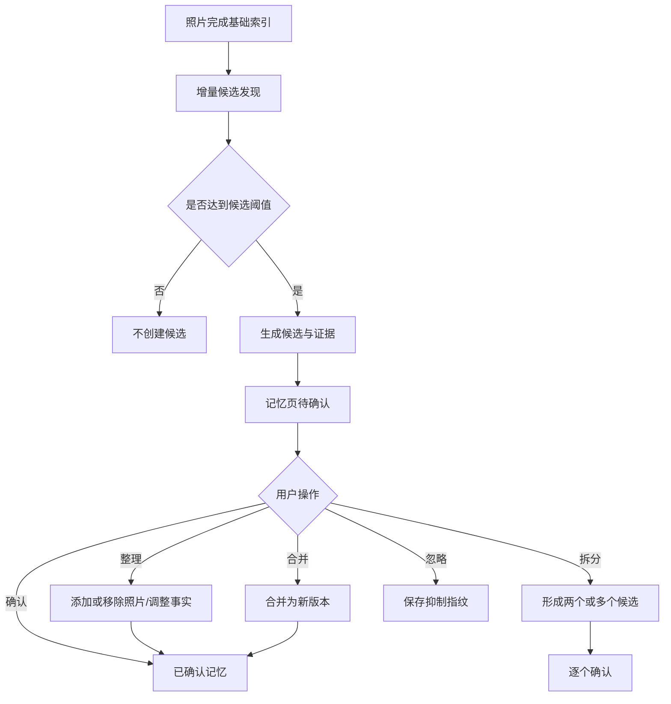
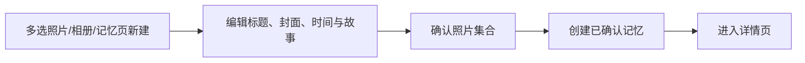
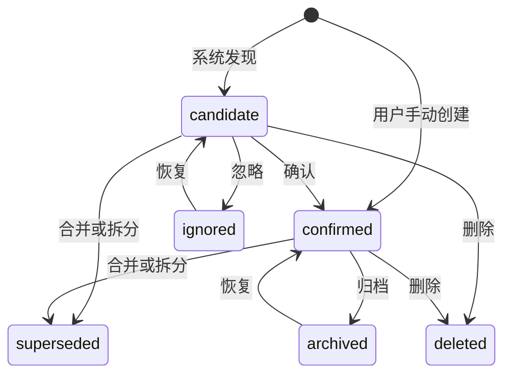
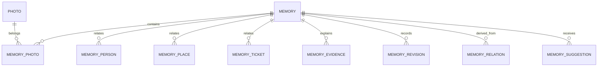

# TrailSnap「记忆片段」完整产品设计

> 需求编号：REQ-126  
> GitHub Issue：#284  
> 目标版本：v0.16.0  
> 文档状态：开发就绪  
> 最后更新：2026-09-21  
> 适用范围：产品、设计、前端、后端、AI、测试与发布


## 实施修订（2026-09-21）

- 自动候选仅使用具有城市信息的照片，并排除已识别为截图的图片；城市变化、相邻拍摄间隔超过 18 小时或事件跨度超过 7 天时切分。
- 旧算法生成且尚未确认的候选会在新版发现时自动失效，已确认记忆不受影响。
- 记忆列表采用服务端分页，同时显示当前区间和总数，保证顶部数量与可浏览数据一致。
- 详情页默认点击照片进入完整浏览器；移除照片需要先显式进入选择模式。
- 已确认记忆可调用用户配置的 AI 对话模型生成故事，模型只能使用时间、地点、人物和照片描述等可核实信息。
- 新建记忆支持唤起 TrailSnap Agent。Agent 先通过对话收集线索、检索并展示候选照片，得到用户明确确认后调用记忆创建工具。

## 1. 文档目的

本文将“记忆片段”从需求描述展开为一套可实现、可测试、可迭代的完整产品方案，覆盖：

- 产品定位、目标用户和成功指标；
- 信息架构、页面结构与 PC/移动端交互；
- 候选发现、确认、忽略、合并、拆分和手动创建流程；
- 时间、地点、人物、票据、照片和故事的数据语义；
- 候选发现算法、置信度、证据和降级规则；
- 领域模型、API、异步任务和权限边界；
- 埋点、灰度发布、验收标准和实施工作包。

本文是 v0.16.0 的统一设计基线。实施中如调整关键产品语义，应同步更新本文，不在前后端各自形成隐含规则。

## 2. 背景

TrailSnap 当前主要通过时间轴、相册、地点、人物和智能分类组织照片。这些结构擅长回答“照片在哪里”，但不能稳定回答“当时发生了什么”。

真实回忆通常以事件存在，例如：

- 一次朋友聚会；
- 一段周末散步；
- 一次返乡；
- 一场演唱会；
- 一段跨越数日的旅行。

自然日不是可靠的事件边界。同一事件可能跨日，同一天也可能包含多个互不相关的事件。普通相册又依赖用户主动整理，无法承担系统发现、推断证据和用户确认的完整闭环。

“记忆片段”在照片之上增加一个事件层，将现有时间、地点、人物、图像语义、票据和文字能力聚合成用户可以理解、确认和再次浏览的经历。

### 2.1 现有能力复用评估

本功能不需要从零建设照片理解链路，以下能力可以直接复用或抽取为领域服务：

| 现有能力 | 当前位置 | 复用方式 |
| --- | --- | --- |
| 拍摄时间和文件归属 | `app/db/models/photo.py` | 事件时间轴与 owner 隔离 |
| GPS、行政区和景区 | `app/db/models/photo_metadata.py` | 地点连续性和候选证据 |
| 人脸与人物身份 | `app/db/models/face.py` | 同行人物和连续性辅助信号 |
| CLIP 图片向量 | `app/db/models/image_vector.py` | 相似去重和语义连续性 |
| 视觉描述与回忆/质量评分 | `app/db/models/image_description.py` | 封面选择、标题和故事素材 |
| 火车票和机票 | `app/db/models/trip.py` | 旅行时间锚点和详情票据节点 |
| 按日位置、精选和文案 | `app/api/moment.py`、`app/service/moment/` | 照片精选、位置摘要和文案生成 |
| Agent 旅行候选 | `discover_trips` 工具和 `travel-album` Skill | 旅行候选规则与故事作品衔接 |
| 异步任务 Worker | `app/service/task_worker.py` | 首次扫描和增量发现 |
| 照片网格、灯箱和人物头像 | `website/src/components/` | 列表、整理页和详情页 |
| 桌面“探索”和移动“回忆与行程” | `website/src/config/navigation.ts` | 新增记忆入口和角标 |

需要新增的核心能力是：独立记忆模型、候选状态与证据、忽略抑制、合并/拆分事务、用户确认保护，以及 PC/移动端的完整整理体验。

现有 `discover_trips` 面向 Agent 工作流中的旅行范围，现有朋友圈布局以自然日为单位。两者可以提供输入和算法经验，但都不能直接作为记忆实体，否则无法覆盖非旅行事件、同日多事件和用户确认语义。

## 3. 产品定义

### 3.1 一句话定义

记忆片段是由系统发现或用户创建、经用户确认后成立的生活事件，集中承载相关照片、人物、地点、票据与故事。

### 3.2 核心对象

产品中同时存在两个阶段：

1. **候选记忆**：系统根据照片和其他数据推断出的可能事件，所有未确认内容都必须展示依据。
2. **已确认记忆**：用户明确确认或主动创建的事件，用户编辑内容具有最高优先级。

两者使用统一的记忆实体，但通过状态和字段来源严格区分。

### 3.3 与相邻概念的区别

| 概念 | 表达内容 | 是否需要用户确认 | 是否允许推断 | 主要用途 |
| --- | --- | --- | --- | --- |
| 时间轴 | 按拍摄时间排列的照片 | 否 | 否 | 浏览原始素材 |
| 普通相册 | 用户选择的一组照片 | 创建即成立 | 否 | 收藏和整理 |
| 智能相册 | 满足动态条件的照片集合 | 否 | 是 | 持续筛选 |
| 朋友圈布局 | 按自然日组织的精选照片和文案 | 否 | 是 | 按日浏览、发布素材 |
| 旅行候选 | 按时间和地点聚合的旅行范围 | 是 | 是 | 旅行日志和 Agent 工作流 |
| 记忆片段 | 一件完整生活事件 | 是 | 是 | 回忆、叙事和内容生成的统一基础 |

记忆片段不替代相册。用户可以从记忆创建相册，也可以从相册创建记忆，但两者继续拥有独立语义。

## 4. 产品目标与非目标

### 4.1 产品目标

1. 系统能够从历史照片中发现可解释的候选事件。
2. 用户能够快速判断候选是否正确，并通过少量操作完成确认。
3. 用户能够合并被错误拆开的事件，或拆分被错误合并的事件。
4. 已确认记忆可以统一展示照片、人物、地点、票据和故事。
5. 用户编辑的事实和内容不会被后续自动分析覆盖。
6. 没有 AI 服务或部分元数据缺失时，用户仍可手动创建和管理记忆。
7. 记忆模型可以被年度回忆、旅行日志、短视频、Agent 和搜索复用。

### 4.2 非目标

v0.16.0 不包含：

- 自动发布到社交平台；
- 自动生成完整视频；
- 根据人物同框推断亲属、恋爱或其他敏感关系；
- 将系统推断直接写成用户确认事实；
- 自动修改照片拍摄时间、GPS、人脸身份或原文件；
- 公共记忆社区和陌生人互动；
- 多人实时协作编辑同一记忆；
- 用大模型替代全部事件边界判断。

## 5. 用户与核心场景

### 5.1 目标用户

#### 长期积累照片的用户

图库规模大，照片跨越多年，难以主动整理全部相册，希望系统帮助发现过去的经历。

#### 旅行记录用户

拥有照片、GPS 和票据，希望将一次旅行重新组织成完整时间线。

#### 家庭与朋友记录用户

照片围绕固定人物产生，希望按聚会、生日、返乡等事件浏览。

#### 元数据不完整的用户

部分旧照片没有 GPS 或视觉分析结果，需要系统保守提示并允许手动补充。

### 5.2 用户任务

| 用户任务 | 用户期望 |
| --- | --- |
| 找回一段经历 | 不需要记住照片文件夹或精确日期 |
| 判断候选是否正确 | 能看到时间、地点、人物和票据依据 |
| 修正系统结果 | 操作成本明显低于重新创建相册 |
| 保存自己的表达 | 标题、封面和故事不会被 AI 覆盖 |
| 再次回忆 | 打开后看到完整、有顺序、有语境的经历 |

### 5.3 代表性场景

#### 场景 A：跨日旅行

10 月 1 日出现前往杭州的高铁票，10 月 1 日至 3 日照片集中在杭州并有相同同行人物。系统生成“杭州三日行”候选，并把车票作为证据。用户确认后修改标题和封面。

#### 场景 B：同一天多个事件

上午是家庭聚餐，晚上在另一地点参加演唱会。时间间隔、地点变化和视觉语义共同触发拆段，系统形成两个候选。

#### 场景 C：用户主动创建

用户多选散落在不同日期的照片，点击“创建记忆”，填写标题和故事。该记忆直接进入已确认状态。

#### 场景 D：错误聚合

系统将一周内多次通勤照片合并成候选。用户忽略后，相同照片集合不再重复出现。

## 6. 产品原则

### 6.1 候选必须可解释

每个自动候选至少展示一种形成依据。不能只显示“AI 发现了一段回忆”。

依据可包括：

- 连续拍摄时间；
- 相同城市或景区；
- 稳定出现的人物；
- 图像语义连续；
- 火车票或机票；
- OCR 中出现的活动或地点信息。

### 6.2 用户事实优先

用户确认、编辑或创建的内容具有最高优先级。后台任务只能生成建议，不能覆盖：

- 用户标题；
- 用户故事；
- 用户封面；
- 用户确认的时间、地点、人物和票据；
- 用户手动调整的照片集合和顺序。

### 6.3 保守发现

错误合并的修正成本和负面感受通常高于错误拆分。因此自动发现应偏向较小、边界较清楚的候选，再提供顺畅的合并能力。

### 6.4 AI 可选，核心功能可降级

没有视觉描述、向量、人脸或 LLM 时：

- 手动创建、编辑和浏览完整可用；
- 自动发现至少使用时间和地点；
- 无地点时仅使用保守时间切段；
- 标题降级为日期与地点组合；
- 故事由用户手动填写。

### 6.5 原始照片安全

确认、合并、拆分或删除记忆只改变关系数据，不移动、不删除、不重命名原始照片。

## 7. 产品范围与版本拆分

### 7.1 v0.16.0 核心范围

- 独立记忆领域模型；
- 候选记忆发现任务；
- 待确认、已确认、已忽略列表；
- 候选证据展示；
- 确认、忽略、合并和拆分；
- 编辑标题、封面、时间、故事和照片；
- 展示人物、地点和票据；
- 从多选照片和相册创建记忆；
- PC 与移动端完整入口；
- 增量分析、忽略抑制和用户编辑保护；
- 无 AI 能力时的降级体验。

### 7.2 v0.16.x 增强范围

- 人物连续性参与候选评分；
- CLIP 语义参与跨日合并；
- 票据参与旅行边界判断；
- AI 标题和故事草稿；
- 新照片补充到已确认记忆的建议；
- 记忆搜索和筛选；
- 批量处理低置信度候选。

### 7.3 后续产品能力

- 从记忆生成旅行日志、长图和视频；
- 往年今日和主动回忆；
- 年度回忆以已确认记忆为基础生成；
- Agent 查询、创建和整理记忆；
- 家庭共享与共同编辑；
- 可撤销的自动补充规则。

## 8. 信息架构

### 8.1 导航

#### PC

在左侧导航“探索”下增加：

```text
探索
├── 人物
├── 智能分类
├── 记忆
└── 月迹
```

“记忆”存在待确认候选时显示数量角标，最多显示 `99+`。

#### 移动端

- 首页增加“待确认记忆”模块，最多展示 3 个候选；
- “更多 → 回忆与行程”中增加“记忆”；
- 记忆入口显示待确认数量；
- 首页模块可以关闭，关闭后仍保留“更多”入口。

### 8.2 路由建议

| 页面 | 路由 | 用途 |
| --- | --- | --- |
| 记忆首页 | `/memories` | 候选和已确认记忆列表 |
| 记忆详情 | `/memories/:id` | 浏览已确认记忆 |
| 候选整理 | `/memories/:id/review` | 确认前调整照片和事实 |
| 手动创建 | `/memories/new` | 从空白、多选照片或相册创建 |
| 拆分 | `/memories/:id/split` | 调整事件边界 |

移动端和 PC 共用路由，通过响应式布局调整交互容器。

## 9. 核心流程

### 9.1 自动候选流程



### 9.2 手动创建流程



### 9.3 新照片补充流程

v0.16.0 不自动修改已确认记忆。新照片与已确认记忆高度相关时，详情页展示非阻断建议：

> 发现 8 张照片可能属于这段记忆。

用户可以查看、全部添加、逐张选择或忽略。忽略后保存本次建议指纹。

## 10. 页面与交互设计

## 10.1 记忆首页

### 页面目标

- 让用户快速处理待确认候选；
- 让已确认记忆成为可持续浏览的内容资产；
- 保留被忽略候选的恢复入口。

### 顶部结构

- 页面标题：“记忆”；
- 副标题：“把散落的照片，重新连成一段经历”；
- 主操作：“新建记忆”；
- 标签页：“待确认”“我的记忆”“已忽略”；
- 筛选：“全部年份”“地点”“人物”；
- 排序：“最近发生”“最近创建”“照片最多”。

首版待确认列表不提供复杂筛选，仅提供年份和“高置信度优先”。

### 候选卡

候选卡包含：

1. 大封面；
2. “待确认”状态；
3. 建议标题；
4. 日期范围；
5. 主要地点；
6. 主要人物头像，最多 3 个；
7. 照片数量；
8. 一行核心证据；
9. “确认记忆”“查看并整理”“忽略”。

证据示例：

> 根据连续拍摄时间、杭州位置和 1 张高铁票形成。

候选卡不直接放置“拆分”和“合并”，避免首次决策区过载。这两个操作放在“查看并整理”页面。

### 已确认卡

已确认记忆卡包含：

- 封面、标题和日期；
- 地点和人物；
- 照片数量；
- 最多两行故事摘要；
- 更多菜单：“编辑”“从记忆创建相册”“归档”。

已确认卡不再展示算法置信度。

### 已忽略列表

已忽略列表使用弱化视觉，展示：

- 原候选封面、标题、日期和照片数；
- 忽略时间；
- “恢复为待确认”；
- “直接创建记忆”。

忽略不删除候选记录，便于审计、恢复和避免重复推荐。

## 10.2 候选整理页

### 页面目标

用户在一个页面内完成候选理解、照片校正和事实确认。

### 页面结构

#### 顶部摘要

- 封面和建议标题；
- 候选置信度只使用“依据充分”“需要检查”两级用户语言，不显示原始百分比；
- 日期范围、主要地点、人物和照片数；
- “确认记忆”主按钮。

#### 形成依据

以可展开卡片展示：

- 时间：`10 月 1 日至 3 日连续拍摄`；
- 地点：`照片主要位于杭州`；
- 人物：`3 位人物在多天重复出现`；
- 票据：`发现 10 月 1 日上海至杭州高铁票`；
- 内容：`多数照片与西湖、寺庙和旅行场景相关`。

每条证据展示来源类型和状态：

- 已确认；
- 待确认；
- 仅供参考。

#### 照片编辑区

- 按时间分组展示候选照片；
- 支持多选后移除；
- “添加附近照片”展示候选时间范围前后 24 小时内的照片；
- 被系统判定为边界不明确的照片使用虚线描边；
- 移除只解除关联，不删除照片；
- 支持选择封面；
- 首版按拍摄时间排序，用户可将少量关键照片标为“重点”，不开放任意全量拖拽排序。

#### 事实编辑区

- 标题；
- 开始和结束时间；
- 地点；
- 人物；
- 票据；
- 故事。

待确认内容使用琥珀色标签；用户点击确认或编辑后转为主题色确认状态。

#### 更多操作

- 拆分记忆；
- 与其他候选合并；
- 忽略候选。

### 离开保护

用户已进行修改但未确认时离开页面，提示：

> 这些调整还没有保存，是否保存为候选草稿？

选择保存后仍保持“待确认”状态。

## 10.3 确认交互

候选未修改时，点击“确认记忆”立即完成，不增加二次弹窗。

以下情况出现轻量确认摘要：

- 候选包含低置信度照片；
- 时间或地点仍有待确认项；
- 关联票据与照片时间存在冲突。

确认摘要示例：

> 将 86 张照片、3 位人物和 1 张高铁票保存为“秋日杭州三日行”。地点“杭州”已确认，详细行程仍可稍后编辑。

确认成功后：

- 状态切换为“已确认”；
- 展示短暂成功反馈；
- 跳转记忆详情；
- 不自动创建普通相册。

## 10.4 忽略交互

点击“忽略”后直接移出待确认列表，并提供 8 秒撤销提示：

> 已忽略这段候选记忆。撤销

不要求用户填写原因。更多菜单中可以选填忽略原因，用于算法评估：

- 这些照片不是同一件事；
- 这段内容没有回忆价值；
- 照片太少或质量较低；
- 其他。

原因只用于产品分析，不应直接当作模型训练标签对外发送。

## 10.5 合并记忆

### 可合并范围

候选整理页默认推荐：

- 时间相邻 7 天以内；
- 地点、人物或语义至少有一项连续；
- 当前用户拥有；
- 状态为待确认或已确认。

用户也可以通过搜索选择更远的记忆。

### 合并预览

合并前展示：

- 合并后的日期范围；
- 照片去重后的数量；
- 保留的标题和封面；
- 人物、地点和票据并集；
- 冲突项。

标题和封面默认规则：

1. 已确认记忆优先于候选；
2. 用户编辑优先于系统生成；
3. 两边都是用户编辑时，要求用户选择；
4. 用户可以在预览中直接填写新标题。

合并完成后，原记忆标记为 `superseded`，保留来源引用和操作记录。新记忆拥有新的 ID，便于审计和撤销。

## 10.6 拆分记忆

### 交互方式

PC 使用横向时间带，移动端使用纵向时间流。系统先根据可能的事件边界提供 1～3 个建议分割点。

用户可以：

- 拖动分割线；
- 在某张照片前选择“从这里拆分”；
- 多选照片后移动到另一段；
- 新增多个分段，首版最多拆成 5 段。

### 拆分预览

每个分段展示：

- 日期范围；
- 代表封面；
- 照片数量；
- 地点和人物摘要；
- 自动建议标题。

票据默认归入与其时间和地点最匹配的分段；无法判断时标为待选择。

拆分完成后：

- 原记忆标记为 `superseded`；
- 生成多个新记忆；
- 原记忆已确认时，新记忆保持已确认，但冲突字段标记为待检查；
- 原记忆为候选时，新记忆保持候选。

## 10.7 记忆详情页

### 页面目标

以经历为中心浏览内容，同时允许用户继续编辑。

### 内容顺序

1. 封面头图；
2. 标题、确认状态和编辑入口；
3. 日期、地点、人物与照片数；
4. “这段记忆”故事；
5. 纵向事件时间线；
6. 照片和视频；
7. 关联票据；
8. 来源和最近编辑信息。

### 时间线节点

首版只展示可靠节点：

- 按天或明显时间段组织的照片组；
- 已确认地点；
- 票据；
- 用户手动添加的文字节点。

不根据少量照片自动编造具体活动。系统生成节点必须可追溯到照片或票据。

### 编辑

编辑模式支持：

- 标题、封面和故事；
- 时间范围；
- 地点、人物和票据；
- 添加或移除照片；
- 将照片标为重点；
- 归档或删除记忆。

删除记忆只删除记忆关系和用户故事，不删除照片、票据或人物数据。删除前展示明确说明。

## 10.8 手动创建记忆

### 入口

- 记忆首页“新建记忆”；
- 照片多选工具栏“创建记忆”；
- 相册更多菜单“创建为记忆”；
- Agent 生成结果中的“保存为记忆”。

### 创建步骤

1. 选择照片；
2. 系统预填时间、地点和人物；
3. 用户填写标题，选择封面；
4. 可选填写故事和关联票据；
5. 保存为已确认记忆。

手动创建不展示算法置信度。系统预填字段在用户保存前使用“建议”状态，保存后转为用户确认。

## 10.9 首页模块

存在待确认候选时，在“那年今日”后展示“发现新的记忆”模块：

- 最多展示 3 张候选卡；
- 只提供“查看”操作，避免首页承担复杂整理；
- “全部查看”进入记忆首页待确认标签；
- 用户可以关闭首页模块 30 天。

没有候选时不展示占位模块。

## 10.10 空状态、加载与错误

### 待确认为空

> 暂时没有新的候选记忆。系统会在照片分析完成后继续发现，你也可以手动创建一段记忆。

操作：“新建记忆”。

### 我的记忆为空

> 把一次旅行、一场聚会或普通的一天保存下来。

操作：“从照片创建”。

### 正在首次分析

展示后台任务进度和说明：

> 正在从时间、地点和人物线索中寻找记忆。你可以离开此页面，分析会在后台继续。

### 部分能力不可用

若 AI 扩展未安装：

> 当前使用时间和地点发现候选。安装 AI 扩展后，可结合人物和画面内容提高准确度。

不阻断用户浏览和手动创建。

### 加载失败

保留已加载内容，提供局部重试。不能用全页错误覆盖用户已经完成的编辑。

## 11. 视觉与内容规范

### 11.1 状态视觉

| 状态 | 视觉 | 文案 |
| --- | --- | --- |
| 待确认 | 琥珀色浅底和图标 | 待确认 |
| 已确认 | 主题色或绿色轻量标识 | 已确认 |
| 已忽略 | 灰色弱化 | 已忽略 |
| 待检查 | 琥珀色虚线或提示图标 | 需要检查 |
| 用户编辑 | 不额外强调 | 作为正式内容展示 |

不能只依赖颜色区分状态，必须同时使用文字或图标。

### 11.2 文案原则

- 推断使用“可能”“根据……形成”“建议”；
- 用户确认后使用陈述语气；
- 不使用“AI 已确定”“真实发生”等绝对表达；
- 不根据人脸同框推断关系；
- 不根据地点自动推断居住地、工作地或宗教行为。

### 11.3 主题与暗色模式

- 强调色使用项目 `primary-*` 工具类；
- 待确认状态使用语义琥珀色，不作为品牌强调色；
- 每个页面统一使用 `gray-*` 灰色族；
- 所有 `bg-white`、`text-gray-*` 和边框提供暗色变体；
- 图片上文字使用渐变遮罩保证可读性；
- 命令式图表或时间线颜色通过 `useTheme` 读取当前主题。

### 11.4 可访问性

- 所有按钮、链接、卡片和自定义菜单项具有 `focus-visible` 焦点环；
- 图标按钮提供 `aria-label`；
- 状态不只依赖颜色；
- 移动端点击区域不小于 44×44 px；
- 时间线支持键盘选择；
- 合并和拆分不能只依赖拖拽，必须提供菜单操作；
- 遵循系统减少动态效果设置；
- 图片提供由标题和日期组合的替代文本。

## 12. 响应式设计

| 能力 | PC | 移动端 |
| --- | --- | --- |
| 记忆列表 | 2～3 列卡片 | 单列卡片 |
| 候选整理 | 左侧照片、右侧摘要 | 分步区块 |
| 证据 | 右侧面板或卡片 | 底部抽屉 |
| 合并选择 | 对话框 + 搜索列表 | 全屏选择页 |
| 拆分 | 横向时间带 | 纵向时间流 |
| 事实编辑 | 右侧抽屉 | 全屏表单 |
| 照片选择 | 多列网格 | 3 列网格 |

移动端不删减核心能力，只调整承载方式。确认、忽略、合并、拆分、编辑和手动创建都必须可完成。

## 13. 数据语义与领域模型

### 13.1 状态机



状态定义：

| 状态 | 含义 | 是否出现在默认列表 |
| --- | --- | --- |
| `candidate` | 系统候选或未确认草稿 | 待确认 |
| `confirmed` | 用户确认或手动创建 | 我的记忆 |
| `ignored` | 用户忽略的候选 | 已忽略 |
| `superseded` | 已被合并或拆分替代 | 否，仅审计 |
| `archived` | 用户主动归档 | 否，可筛选 |
| `deleted` | 软删除 | 否 |

### 13.2 实体关系



### 13.3 `memories`

建议字段：

| 字段 | 类型 | 说明 |
| --- | --- | --- |
| `id` | UUID | 主键 |
| `owner_id` | UUID | 所有者 |
| `status` | enum | 候选、确认、忽略等 |
| `origin` | enum | `auto`、`manual`、`album`、`agent` |
| `title` | string | 当前展示标题 |
| `title_source` | enum | `system` 或 `user` |
| `story` | text | 当前故事 |
| `story_source` | enum | `system` 或 `user` |
| `cover_photo_id` | UUID | 封面照片 |
| `cover_source` | enum | `system` 或 `user` |
| `start_time` | datetime | 事件开始时间 |
| `end_time` | datetime | 事件结束时间 |
| `time_source` | enum | `inferred` 或 `confirmed` |
| `confidence` | decimal | 内部候选置信度，不直接展示百分比 |
| `algorithm_version` | string | 生成算法版本 |
| `candidate_fingerprint` | string | 候选集合指纹 |
| `confirmed_at` | datetime | 确认时间 |
| `ignored_at` | datetime | 忽略时间 |
| `created_at` | datetime | 创建时间 |
| `updated_at` | datetime | 更新时间 |
| `deleted_at` | datetime | 软删除时间 |

索引建议：

- `(owner_id, status, start_time desc)`；
- `(owner_id, candidate_fingerprint)`；
- `(owner_id, updated_at desc)`；
- `cover_photo_id`；
- 所有外键使用合适的 `CASCADE` 或 `SET NULL`。

### 13.4 `memory_photos`

| 字段 | 说明 |
| --- | --- |
| `memory_id` / `photo_id` | 联合唯一关系 |
| `role` | `normal`、`highlight`、`cover` |
| `source` | `inferred`、`user_added`、`album_import` |
| `confidence` | 系统关联置信度 |
| `is_confirmed` | 用户是否确认关联 |
| `sort_time` | 默认按拍摄时间 |
| `created_at` | 关联时间 |

同一张照片允许属于多个记忆。系统自动候选在同一批同一粒度内只分配一个主要候选，减少重复卡片。

### 13.5 人物、地点和票据关联

建议使用独立关联表，避免多态外键失去约束：

- `memory_people(memory_id, face_identity_id, source, confidence, is_confirmed)`；
- `memory_places(memory_id, scene_id, place_name_snapshot, level, source, confidence, is_confirmed)`；
- `memory_train_tickets(memory_id, ticket_id, source, confidence, is_confirmed)`；
- `memory_flight_tickets(memory_id, ticket_id, source, confidence, is_confirmed)`。

地点保留展示名称快照，避免外部逆地理信息变化导致历史记忆标题不可解释，但仍保留 `scene_id` 关联。

### 13.6 证据

`memory_evidence` 保存候选形成依据：

| 字段 | 说明 |
| --- | --- |
| `type` | `time`、`place`、`people`、`semantic`、`ticket`、`ocr` |
| `summary` | 用户可读说明 |
| `score` | 内部评分 |
| `source_refs` | 来源照片、人物或票据 ID |
| `payload` | 可审计的结构化数据 |
| `algorithm_version` | 证据生成版本 |

证据数据不保存模型的隐藏推理，仅保存可验证输入和简洁结论。

### 13.7 修订与来源关系

`memory_revisions` 保存用户可见字段和照片集合的重要变更，用于审计和后续撤销。

`memory_relations` 保存：

- `merged_from`；
- `split_from`；
- `created_from_album`；
- `created_from_artifact`。

## 14. 候选发现设计

### 14.1 输入条件

基础输入：

- 未删除且属于当前用户的照片；
- 有可靠 `photo_time` 的照片；
- 可选 GPS、Scene、人物、视觉向量、描述、OCR 和票据。

默认排除：

- 明确标记为截图且没有事件语义的内容；
- 软删除照片；
- 时间明显异常的照片；
- 用户已排除出自动记忆发现的照片；
- 与现有忽略指纹高度一致的候选集合。

截图不是永久排除项。票据截图、活动二维码或聊天记录可能具有事件价值，应由 OCR、票据识别和用户操作重新纳入。

### 14.2 发现管线

```text
照片过滤
  → 时间初分段
  → 硬边界检查
  → 地点连续性计算
  → 人物与语义连续性计算
  → 相邻片段保守合并
  → 低价值候选过滤
  → 证据、封面和标题生成
  → 指纹去重
  → 候选持久化
```

### 14.3 时间初分段

建议初始规则：

- 相邻照片间隔小于 2 小时：优先保持同段；
- 2～6 小时：进入边界评分；
- 超过 6 小时：默认切段；
- 跨夜但地点和人物高度连续：允许合并；
- 连续旅行中最多允许 18 小时无照片，但必须有地点、票据或相邻日期连续性支持；
- 单个自动候选最长 14 天，超过后默认按自然行程边界拆分。

这些是初始可配置参数，不写死在 UI 或数据库枚举中。

### 14.4 硬边界

出现以下情况时优先切段：

- 极短时间内出现不可能的地理跳跃且没有交通票据；
- 明确从一个长时间事件结束后回到常驻地点；
- 相邻片段间隔超过 24 小时且没有共同证据；
- 用户历史上曾在同一照片边界执行拆分；
- 一侧为大量截图/工作资料，另一侧为相机生活照片。

### 14.5 连续性评分

初版建议使用可解释加权评分：

```text
continuity = 0.30 × time
           + 0.25 × place
           + 0.15 × people
           + 0.20 × semantic
           + 0.10 × ticket
```

规则：

- 任一信号缺失时，对现有信号重新归一化，不把缺失当作负值；
- `continuity ≥ 0.72` 可以自动合并相邻片段；
- `0.55 ≤ continuity < 0.72` 保持分开，但互相作为“可合并候选”；
- `< 0.55` 保持独立；
- 硬边界优先于总分。

阈值必须通过真实图库离线评估后调整。版本号记录在候选中，避免算法升级后无法解释旧候选。

### 14.6 地点连续性

优先级：

1. 相同 `scene_id`；
2. GPS 距离和时间推算；
3. 相同城市或区县；
4. 地址文本；
5. 无地点信息。

同城市只能作为弱连续性，不足以单独合并多天照片。跨城但有交通票据时，可以属于同一旅行记忆。

### 14.7 人物连续性

- 只使用已归类且未隐藏的人物；
- 人物重复出现可以提高连续性；
- 没有人脸不降低分数；
- 同框只表示共同出现在照片中；
- 不推断人物关系；
- 单一高频人物不能让跨度很长的普通生活照片自动合并。

### 14.8 语义连续性

- 使用 CLIP 图片向量、视觉标签和描述；
- 先对连拍和高度相似照片去重，再计算片段中心；
- 语义只作为辅助信号；
- 视觉描述中的地点不能覆盖 GPS 或用户确认地点；
- OCR 文本按不可信外部内容处理，不能成为系统指令。

### 14.9 票据

票据是强时间锚点，但不是事件事实本身。

关联规则：

- 票据时间位于候选开始前 24 小时至结束时间内；
- 出发地或目的地与候选地点匹配；
- 票据属于当前用户；
- 票据来源照片可以同时加入候选；
- 冲突票据标记为待确认，不参与自动标题。

### 14.10 候选价值过滤

默认满足以下任一条件才创建候选：

- 至少 5 张有效照片；
- 至少 3 张照片且包含已识别票据；
- 至少 3 张照片且跨越两个明显地点节点；
- 用户曾将相似范围保存为相册或作品。

以下候选默认降权：

- 全部是高度重复连拍；
- 全部是低质量截图；
- 时间和地点都不可靠；
- 与已确认记忆高度重叠且没有新增内容。

### 14.11 封面选择

综合：

- 回忆分；
- 画面质量；
- 清晰度和主体完整性；
- 人物和地点代表性；
- 与其他卡片封面的视觉差异；
- 横向封面裁切安全区域。

用户选定封面后永久优先，除非该照片被删除或从记忆移除。

### 14.12 标题与故事

无 LLM 时：

- 有地点：`2026 年 10 月 · 杭州`；
- 有明确活动 OCR：`2026 年 10 月 · 音乐节`；
- 无地点：`2026 年 10 月 3 日的记忆`。

有 LLM 时，输入只包含结构化摘要和有限视觉描述，输出标题候选和故事草稿。故事必须：

- 不编造没有证据的活动；
- 不推断敏感人物关系；
- 标明为 AI 草稿；
- 用户编辑后将来源改为 `user`。

### 14.13 指纹与抑制

候选指纹由以下内容稳定生成：

- 核心照片 ID 集合；
- 归一化日期范围；
- 主要地点；
- 算法主版本。

被忽略候选在核心照片集合变化不足 20% 时不重新提示。出现以下情况可以生成新建议：

- 新增大量相关照片；
- 时间或地点元数据被用户修正；
- 用户主动恢复；
- 算法主版本升级且系统明确提示重新分析。

## 15. 增量更新与冲突规则

### 15.1 首次扫描

- 按年份或月份分批；
- 新用户优先处理最近 12 个月；
- 候选逐批可见，不等待全库完成；
- 前端展示进度但不阻塞使用；
- 任务可暂停、恢复和取消。

### 15.2 新照片

- 完成时间和基础元数据后进入局部分析；
- 只重算相邻时间窗口；
- 与已确认记忆匹配时生成补充建议；
- 不直接加入已确认记忆。

### 15.3 元数据变化

用户修改照片时间、地点或人物后：

- 候选记忆可以局部重算；
- 已确认记忆保持照片集合不变；
- 如果事实冲突，在详情页显示“信息已变化”提示；
- 用户可以接受更新或保留原确认值。

### 15.4 照片删除

- 软删除照片从默认展示中移除；
- 封面被删除时自动选择新封面，并提示用户；
- 记忆没有任何照片后保留故事并进入异常状态，允许删除或重新添加；
- 恢复照片后恢复关联。

## 16. API 设计

所有新增 API 使用统一 `BaseResponse`：

```json
{
  "code": 0,
  "message": "success",
  "data": {}
}
```

### 16.1 查询

```http
GET /api/memories?status=candidate&year=2026&cursor=...
GET /api/memories/{memory_id}
GET /api/memories/{memory_id}/evidence
GET /api/memories/{memory_id}/nearby-photos
GET /api/memories/{memory_id}/merge-candidates
GET /api/memories/discovery/status
```

列表响应包含卡片所需摘要，不返回全部照片和证据详情。

### 16.2 创建与编辑

```http
POST  /api/memories
PATCH /api/memories/{memory_id}
PUT   /api/memories/{memory_id}/photos
POST  /api/memories/{memory_id}/photos:add
POST  /api/memories/{memory_id}/photos:remove
POST  /api/memories/{memory_id}:confirm
POST  /api/memories/{memory_id}:ignore
POST  /api/memories/{memory_id}:restore
POST  /api/memories/{memory_id}:archive
DELETE /api/memories/{memory_id}
```

### 16.3 合并与拆分

```http
POST /api/memories:merge-preview
POST /api/memories:merge
POST /api/memories/{memory_id}:split-preview
POST /api/memories/{memory_id}:split
```

预览接口不写数据库，只返回冲突、照片数量、建议标题和关联实体分配。执行接口携带预览版本号，防止预览后数据变化导致误操作。

### 16.4 发现任务

```http
POST /api/memories/discovery/tasks
GET  /api/memories/discovery/tasks/{task_id}
POST /api/memories/discovery/tasks/{task_id}:cancel
POST /api/memories/discovery:rescan-range
```

重复创建相同范围任务时返回现有任务，保证幂等。

### 16.5 更新请求示例

```json
{
  "title": "第一次带爸妈去杭州",
  "story": "十月的杭州仍有夏末的温度……",
  "cover_photo_id": "uuid",
  "start_time": "2026-10-01T09:00:00",
  "end_time": "2026-10-03T18:00:00",
  "confirmed_fields": ["title", "cover", "time", "place"]
}
```

服务端从登录态获取 `owner_id`，不接受客户端指定所有者。

## 17. 后端与任务架构

### 17.1 模块建议

```text
package/server/app/
├── api/memory.py
├── schemas/memory.py
├── crud/memory.py
├── db/models/memory.py
├── service/memory/
│   ├── discovery.py
│   ├── segmentation.py
│   ├── scoring.py
│   ├── evidence.py
│   ├── merge.py
│   ├── split.py
│   ├── suggestion.py
│   └── title_story.py
└── service/tasks/memory.py
```

API 保持轻量，权限、状态机、合并和拆分事务放在领域服务中。

### 17.2 新任务类型

建议增加：

- `DISCOVER_MEMORIES`：按时间范围发现候选；
- `REFRESH_MEMORY_CANDIDATE`：局部刷新候选；
- `ENRICH_MEMORY`：人物、语义、标题和故事增强。

基础发现与 AI 增强拆开。没有 AI 服务时，`DISCOVER_MEMORIES` 仍可完成。

### 17.3 事务要求

以下操作必须在数据库事务内完成：

- 确认；
- 合并；
- 拆分；
- 删除；
- 批量调整照片；
- 用户字段来源更新。

合并和拆分对源记忆加行锁，并通过版本号阻止重复提交。

### 17.4 数据库迁移

新增 ORM 后生成 Alembic 迁移。迁移必须包含：

- 新表和索引；
- 枚举或检查约束；
- 外键删除策略；
- PostgreSQL 与 SQLite 测试兼容；
- 回滚路径。

## 18. 前端架构

### 18.1 模块建议

```text
package/website/src/
├── api/memory.ts
├── stores/memoryStore.ts
├── types/memory.ts
├── views/memory/
│   ├── MemoryList.vue
│   ├── MemoryDetail.vue
│   ├── MemoryReview.vue
│   ├── MemoryCreate.vue
│   └── MemorySplit.vue
├── components/memory/
│   ├── MemoryCard.vue
│   ├── MemoryEvidence.vue
│   ├── MemoryTimeline.vue
│   ├── MemoryPhotoEditor.vue
│   ├── MemoryFactEditor.vue
│   ├── MemoryMergeDialog.vue
│   └── MemorySuggestion.vue
└── composables/
    ├── useMemoryDiscovery.ts
    └── useMemoryEditor.ts
```

### 18.2 Store 边界

`memoryStore` 管理：

- 当前标签和筛选；
- 游标分页列表；
- 待确认数量；
- 当前详情缓存；
- 候选确认、忽略后的局部更新；
- 发现任务状态。

编辑草稿保留在页面级 composable，不将未保存大对象长期放入全局 store。

### 18.3 可复用能力

- 照片网格和灯箱复用现有组件；
- 人物头像复用 `PersonAvatar`；
- 图片 URL 统一使用现有媒体工具；
- 票据卡复用并收敛当前车票和机票展示模型；
- 封面选择使用现有照片选择能力；
- 主题使用 `useTheme` 和 `primary-*`。

## 19. 权限、隐私与安全

1. 所有记忆及关联查询显式过滤 `owner_id`。
2. 客户端提交的照片、人物和票据 ID 必须逐项校验归属。
3. 合并不能跨用户，也不能合并已删除记忆。
4. 记忆详情不返回原始文件路径。
5. AI 只接收完成任务所需的缩略图和结构化摘要。
6. GPS 在界面默认显示地点名称，不展示精确坐标。
7. 删除记忆不删除原始照片和票据。
8. OCR、照片描述和用户故事均按不可信文本处理，不能作为 Agent 或 LLM 系统指令。
9. 人物同框不用于推断敏感关系。
10. 分享能力上线前，不生成无需鉴权的公开记忆链接。

## 20. 埋点与产品指标

### 20.1 事件

| 事件 | 关键属性 |
| --- | --- |
| `memory_list_viewed` | tab、candidate_count |
| `memory_candidate_opened` | memory_id、confidence_level、evidence_types |
| `memory_candidate_confirmed` | edit_count、photo_delta、duration_ms |
| `memory_candidate_ignored` | reason、undo |
| `memory_merge_completed` | source_count、photo_count |
| `memory_split_completed` | segment_count、boundary_source |
| `memory_created_manual` | source、photo_count |
| `memory_edited` | fields、photo_delta |
| `memory_suggestion_accepted` | suggestion_type、added_count |
| `memory_detail_viewed` | origin、age_days |
| `memory_discovery_completed` | duration、photo_count、candidate_count、algorithm_version |

埋点不上传照片内容、精确 GPS、故事正文和人物姓名。

### 20.2 核心指标

#### 北极星指标

每周被再次打开的已确认记忆数量。

该指标同时反映记忆是否成功创建，以及是否真正具有长期回忆价值。

#### 过程指标

- 候选确认率；
- 候选忽略率；
- 候选确认中位耗时；
- 确认前照片增删比例；
- 合并率与拆分率；
- 用户修改标题和封面的比例；
- 手动创建占比；
- 已确认记忆 7 日、30 日再次访问率；
- 每万张照片的候选数量；
- 候选发现任务失败率。

### 20.3 质量警戒线

- 忽略率持续高于 60%：暂停扩大入口曝光并复查候选阈值；
- 确认前平均移除照片超过 30%：说明错误合并严重；
- 拆分率明显高于合并率：缩短自动候选边界；
- 发现任务失败率高于 2%：阻止全量发布；
- 用户编辑字段被后台覆盖：视为 P0 数据事故，必须为 0。

## 21. 性能与容量目标

### 21.1 API

- 记忆列表 P95 小于 500 ms，不含图片加载；
- 记忆详情 P95 小于 800 ms；
- 确认、忽略 P95 小于 500 ms；
- 合并、拆分普通规模 P95 小于 2 s；
- 列表使用游标分页，每页默认 20，最大 50。

### 21.2 发现任务

- 10 万张照片首次发现可在后台分批完成；
- 不阻塞照片上传、浏览和已有任务；
- 内存使用有明确上限，不一次加载全部向量；
- 每批失败可以重试，不重复创建候选；
- 新照片仅重算局部时间窗口。

### 21.3 前端

- 卡片图片懒加载；
- 大量照片继续使用虚拟列表；
- 移动端首屏只请求必要卡片摘要；
- 详情照片分页或按时间段加载；
- 路由懒加载，不增加首页首包体积。

## 22. 测试策略

### 22.1 单元测试

- 时间切段边界；
- 跨夜旅行合并；
- 同日多个事件拆分；
- 地点跳跃硬边界；
- 缺失信号重新归一化；
- 指纹稳定性与忽略抑制；
- 用户字段不被刷新覆盖；
- 封面照片移除后的回退；
- 合并字段优先级；
- 拆分后票据分配；
- 跨用户 ID 拒绝。

### 22.2 集成测试

- 候选发现任务到数据库落库；
- 候选确认完整事务；
- 忽略后重新扫描不重复出现；
- 合并和拆分的源关系与新记录；
- 照片软删除和恢复；
- 无 AI 服务的降级发现；
- BaseResponse 格式；
- 并发确认、合并和拆分的版本冲突。

### 22.3 E2E

#### E2E-1：确认候选

1. 打开待确认列表；
2. 查看证据；
3. 修改标题和封面；
4. 确认；
5. 在“我的记忆”打开详情；
6. 刷新后内容保持。

#### E2E-2：忽略与恢复

1. 忽略候选；
2. 撤销；
3. 再次忽略；
4. 在已忽略列表恢复。

#### E2E-3：合并

1. 选择两个候选；
2. 查看合并预览；
3. 处理标题冲突；
4. 完成合并；
5. 验证照片、人物、地点和票据并集。

#### E2E-4：拆分

1. 打开候选整理；
2. 在建议边界拆分；
3. 移动一张照片；
4. 确认两个分段；
5. 验证原候选不再出现在默认列表。

#### E2E-5：移动端

完成查看候选、确认、整理、合并、拆分和手动创建，不出现横向溢出或被底部导航遮挡。

### 22.4 算法评估集

建立脱敏评估集，至少覆盖：

- 单日聚会；
- 同日多个活动；
- 跨日旅行；
- 跨城交通；
- 长时间无照片；
- 无 GPS；
- 无人物；
- 截图和票据混合；
- 日常通勤；
- 大量连拍；
- 时区变化；
- 时间错误照片。

人工标注事件边界，用精确率、召回率、过度合并率和过度拆分率评估。产品优先压低过度合并率。

## 23. 验收标准

### 23.1 功能验收

- [ ] 用户可以查看系统发现的候选记忆及至少一种形成依据。
- [ ] 用户可以确认、忽略并恢复候选。
- [ ] 用户可以在确认前添加、移除照片并调整封面。
- [ ] 用户可以合并两个或多个候选或已确认记忆。
- [ ] 用户可以将一个候选或已确认记忆拆成多个片段。
- [ ] 用户可以编辑标题、时间、封面、人物、地点、票据和故事。
- [ ] 详情页可以展示照片、人物、地点、票据和事件时间线。
- [ ] 用户可以从多选照片、相册和空白入口创建已确认记忆。
- [ ] 被忽略且照片集合未明显变化的候选不会再次提示。
- [ ] PC 与移动端可以完成全部核心操作。

### 23.2 数据验收

- [ ] 系统推断和用户确认字段可区分。
- [ ] 用户编辑在重算、重启和算法升级后保持不变。
- [ ] 合并和拆分保留来源关系与操作记录。
- [ ] 删除记忆不会删除原始照片或票据。
- [ ] 一张照片可以属于多个用户创建或确认的记忆。
- [ ] 所有写操作校验当前用户所有权。
- [ ] 所有新增 API 使用 `BaseResponse`。

### 23.3 体验验收

- [ ] 用户在候选卡上能理解候选形成原因。
- [ ] 普通候选可在 3 个主要操作内完成确认。
- [ ] 推断内容不会以用户已确认事实的视觉展示。
- [ ] 仅使用颜色以外的文字或图标表达状态。
- [ ] 键盘可完成主要 PC 操作。
- [ ] 暗色模式无明显接缝、不可读文字或错误品牌色。

### 23.4 性能验收

- [ ] 10 万张照片可以通过后台分批分析，不阻塞浏览。
- [ ] 增量分析不全量重扫图库。
- [ ] 任务失败可重试且不生成重复候选。
- [ ] 页面和 API 达到第 21 节性能目标。

## 24. 灰度与发布

### 24.1 功能开关

建议增加：

- `memory_feature_enabled`；
- `memory_discovery_enabled`；
- `memory_ai_enrichment_enabled`；
- `memory_home_module_enabled`。

手动记忆与自动发现分开控制。自动算法出现问题时，可以关闭发现而不影响用户已有记忆。

### 24.2 灰度顺序

1. 开发和测试账号；
2. 仅开放手动创建和详情；
3. 小范围开放时间、地点候选；
4. 收集确认、忽略、合并和拆分数据；
5. 调整阈值后扩大范围；
6. 开启人物、语义和票据增强；
7. 首页曝光待确认模块。

### 24.3 首次使用引导

首次进入记忆页展示一次性说明：

> 记忆片段会根据照片的时间、地点和其他线索提出候选。确认前，它们都只是建议；你的修改会被永久保留。

操作：

- “开始发现”；
- “先手动创建”；
- “暂不使用”。

### 24.4 回滚

- 关闭自动发现任务；
- 保留已确认记忆和手动功能；
- 隐藏未处理候选但不删除；
- 数据库迁移不在应用回滚时直接删除用户数据；
- 算法升级保留旧版本和候选来源。

## 25. 实施工作包

### WP1：领域模型与迁移

- Memory 及关联模型；
- 状态机和字段来源；
- Alembic 迁移；
- owner 隔离和 CRUD；
- 单元测试。

### WP2：手动记忆闭环

- 创建、编辑、详情和删除；
- 从照片和相册创建；
- 照片、人物、地点和票据展示；
- PC 和移动端基础页面。

完成后即使自动发现未开放，产品也可以独立使用。

### WP3：基础候选发现

- 时间和地点切段；
- 价值过滤；
- 证据与指纹；
- Worker 任务和进度；
- 待确认与已忽略列表。

### WP4：确认与校正

- 候选整理；
- 照片添加、移除和封面；
- 确认、忽略、恢复；
- 用户编辑保护；
- 局部刷新。

### WP5：合并与拆分

- 预览接口；
- 冲突处理；
- 事务、来源关系和版本控制；
- PC/移动端交互；
- 完整 E2E。

### WP6：智能增强

- 人物和语义连续性；
- 票据锚点；
- AI 标题和故事；
- 已确认记忆补充建议；
- 无 AI 降级验证。

### WP7：指标、灰度与发布

- 埋点；
- 功能开关；
- 算法评估集；
- 性能压测；
- 用户引导；
- 发布检查和文档更新。

## 26. 建议里程碑

| 里程碑 | 交付结果 | 发布条件 |
| --- | --- | --- |
| M1：记忆可创建 | 手动创建、编辑、详情完整 | 数据模型和移动端可用 |
| M2：记忆可发现 | 时间地点候选、证据、确认和忽略 | 评估集中过度合并受控 |
| M3：记忆可修正 | 合并、拆分和增量建议 | 事务和 E2E 完整 |
| M4：记忆更智能 | 人物、语义、票据和 AI 故事 | 无 AI 降级可用 |
| M5：正式发布 | 灰度、指标、性能与发布文档 | 所有 P0 验收通过 |

## 27. 完整产品完成定义

“记忆片段”达到完整产品状态，需要同时满足：

### 用户闭环

用户可以发现、理解、确认、修正、创建、浏览、编辑、归档和删除记忆。

### 数据闭环

系统能够记录推断来源、用户确认、版本关系、忽略指纹和增量建议，且不会覆盖用户事实。

### 智能闭环

系统能够基于时间和地点稳定工作，并在人物、语义、票据和 LLM 可用时增强结果；任何增强能力缺失都不会破坏核心体验。

### 工程闭环

具备迁移、权限、异步任务、幂等、并发控制、测试、监控、灰度和回滚能力。

### 产品闭环

有明确成功指标，可以根据确认、忽略、合并和拆分行为持续调整发现质量，同时保护用户隐私和数据安全。

达到以上条件后，记忆片段才不只是一个聚类页面，而是 TrailSnap 中可被其他回忆、旅行和 AI 能力长期复用的核心产品。

## 28. 设计决策摘要

1. 记忆片段使用独立领域模型，不复用普通相册或按日朋友圈数据。
2. 候选和已确认记忆共享实体，通过状态和字段来源严格区分。
3. 候选必须展示可验证证据，置信度不以生硬百分比直接面向用户。
4. 自动发现采用可解释规则和向量信号，大模型只负责标题与故事增强。
5. 自动算法偏向保守切分，通过合并弥补，不追求一次全自动正确。
6. 合并和拆分创建新版本，原记录保留为来源，保证审计和撤销基础。
7. 用户确认和编辑永久优先，后台任务只生成建议。
8. 手动创建和浏览不依赖 AI，确保自托管环境中的稳定可用性。
9. PC 与移动端拥有完整功能，移动端通过全屏页和底部抽屉承载复杂操作。
10. v0.16.0 先完成事件模型和纠错闭环，再逐步提高智能发现质量。
