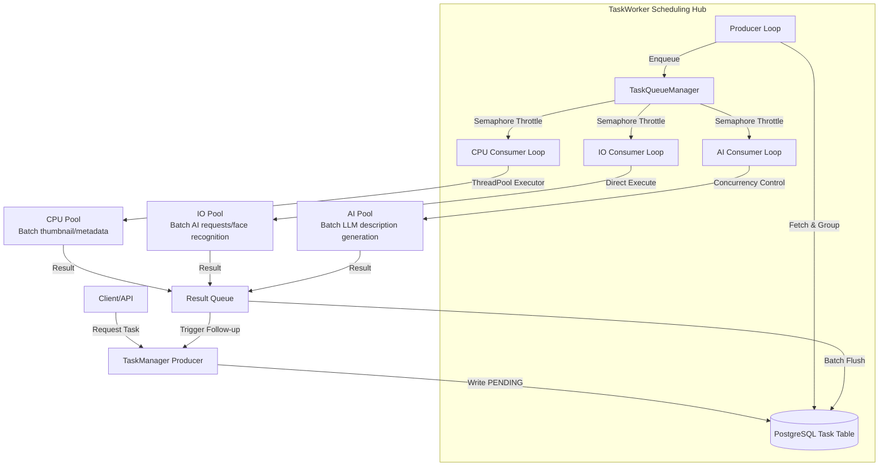

# Task Management Module Design

> TrailSnap is an AI photo album deployed on NAS devices. This architecture is designed with NAS characteristics in mind (typically low CPU performance, no GPU acceleration, large photo collections stored on HDDs, while Docker and other software are installed on SSDs).

## 1. Overall Architecture

The task management module adopts a **Multi-Level Buffer + Producer-Consumer** model, using **PostgreSQL as the persistent backend and in-memory priority queues as the scheduling hub**, achieving complete decoupling between task production and consumption. The architecture consists of four core components:

- **Producer (TaskManager)**: Runs in the API service process, responsible for receiving user requests or system-triggered events, generating tasks and writing them to the database.
- **Persistent Task Queue (Database Table)**: The `Task` table serves as reliable persistent storage, storing task type, status, priority, payload parameters, etc., ensuring tasks survive service restarts.
- **Scheduling Hub (TaskQueueManager)**: An in-memory scheduling module in `task_worker.py` that maintains three independent priority queues (CPU / IO / AI), responsible for batch-fetching tasks from the database and priority-sorting them.
- **Consumers (TaskWorker)**: Three independent worker coroutines (CPU Consumer, IO Consumer, AI Consumer), each listening to its categorized queue, consuming tasks at **adaptive rates** and processing them through execution pools.

### Architecture Diagram




## 2. Core Design Principles

### 2.1 Strategy + Factory Pattern

The task execution layer uses the **Strategy Pattern** for complete decoupling:

- **BaseTaskStrategy** (abstract base class): Defines the interface all task handlers must implement, including `process()` (single task), `process_batch()` (batch processing), and `handle_completion()` (completion callback).
- **TaskStrategyFactory** (strategy factory): Uses class method registration (`@TaskStrategyFactory.register(TaskType.XXX)`) to maintain a mapping from `TaskType` to concrete strategy classes. The scheduling layer has no dependency on specific task types — it only obtains strategy instances dynamically through the factory, achieving the **Open-Closed Principle (OCP)**: adding new task types requires no changes to the scheduling core.

### 2.2 Feedback-Driven Adaptive Production

A common problem with traditional polling models is **wasteful database I/O**: data is fetched at a fixed frequency regardless of queue backlog.

This system implements **queue-depth feedback-driven** production logic:

- `TaskQueueManager` exposes the `qsize()` of all three queues in real time.
- The producer checks whether each queue length is below a threshold (`QUEUE_THRESHOLD = 50`) before every loop.
- **Tasks are only fetched from the database when a queue is idle and below the threshold**. Fast consumption triggers fast replenishment; slow consumption halts production — a truly "consumption-driven production" energy-efficient model.

### 2.3 Multi-Level Batching

To maximize processing efficiency and reduce database I/O frequency, the system implements a **three-level buffer architecture**:

1. **Database**: As persistent storage, each query fetches up to 150 PENDING tasks.
2. **In-memory task queues**: These 150 tasks are grouped by `TaskType`, then sub-grouped into batches of 8. Each group is an "raw batch" placed into the corresponding categorized queue.
3. **Execution pools**: When an execution pool receives a raw batch, it obtains the corresponding strategy instance from the factory and calls `process_batch()` for batch processing, reducing CPU scheduling overhead.

This design ensures low-frequency database I/O (fetching a large batch at once), lightweight in-memory task objects, and maximum utilization of the AI microservice batch API (8 images per batch is the optimal throughput point).

### 2.4 Priority Queue Scheduling

`TaskQueueManager` uses `asyncio.PriorityQueue` for each categorized queue:

```python
# Enqueue element structure: (negative priority, counter, batch list)
await queue.put((-priority, count, batch))
```

- **Priority negation**: Python's min-heap pops the smallest value first, so negation makes **higher priority values get consumed first**.
- **Counter tiebreaker**: When two batches have the same priority, a monotonically increasing counter differentiates them, avoiding `TypeError` from comparing dictionaries.

## 3. Producer & Consumer Coordination

TaskManager serves as the task entry point, containing five coroutines:

1. **task Worker** (producer coroutine): Monitors task queue status, fetches tasks from the database based on thresholds, and pushes them into the corresponding queues.

2. **CPU Consumer** (consumer coroutine): Takes batches from the CPU queue, processes thumbnails/metadata in bulk.

3. **IO Consumer** (consumer coroutine): Takes batches from the IO queue, processes AI requests/face recognition in bulk.

4. **AI Consumer** (consumer coroutine): Takes batches from the AI queue, processes LLM description generation in bulk.

5. **Result Handler** (result coroutine): Gets processing results from `result_queue`, batch-updates database status.

### Producer & Scheduling Hub

- **Responsibilities**: Batch-fetch PENDING tasks from the database, group by TaskType, split into standard batches (≤ 8 per batch), assign the priority of the first element as the batch priority, and push into the corresponding in-memory categorized queue.

### Consumer Concurrency Control

Each consumer coroutine maintains an `asyncio.Semaphore` for **fine-grained concurrency control**:

| Queue Type | Max Concurrency | Use Case |
|---------|-----------|---------|
| CPU     | `os.cpu_count() or 4` | Thumbnail generation, metadata extraction |
| IO      | `10` | Face recognition, OCR, image classification, vector embedding |
| AI      | `2` | Visual description generation (depends on LLM, scarce resource) |

A consumer must acquire a semaphore permit before taking a batch from the queue — this ensures that even if the database fetches a large number of tasks at once, memory won't be exhausted by unlimited concurrency.

### Async Result Processing

After each task completes, the database status is not updated immediately. Instead, results are written to `result_queue` and batch-processed by the `Result Handler` coroutine.

## 4. Task Strategy System

All concrete task handlers inherit from `BaseTaskStrategy` and register via `@TaskStrategyFactory.register(TaskType.XXX)`.

### 4.1 Strategy Base Class Interface

```python
class BaseTaskStrategy(ABC):
    @property
    @abstractmethod
    def task_category(self) -> str:  # Returns 'CPU' | 'IO' | 'AI'
        pass

    @abstractmethod
    async def process(self, worker, task: Task, db: Session) -> Any:
        pass  # Single task processing (legacy interface)

    async def process_batch(self, worker, tasks: List[Task], db: Session) -> List[Dict]:
        # Default: calls process() in a loop; subclasses can override for true batch processing
        results = []
        for task in tasks:
            res = await self.process(worker, task, db)
            results.append({...})
        return results

    async def handle_completion(self, worker, items: List[Dict], db: Session) -> None:
        # Post-completion callback for triggering follow-up task chains
        # (e.g. PROCESS_BASIC completion triggers metadata extraction)
        pass
```

### 4.2 Typical Strategy Implementations

#### BasicTaskStrategy (CPU Batch Processing)

CPU tasks (e.g. thumbnail generation) involve heavy synchronous blocking I/O (file reads/writes) and CPU computation (OpenCV).

**Optimization**: Implements `process_basic_cpu_batch_job`, which processes 8 sub-tasks sequentially within a **single thread pool call**:

```python
def process_basic_cpu_batch_job(tasks_data: List[Dict]) -> List[Dict]:
    results = []
    for data in tasks_data:
        res = process_basic_cpu_job(data['file_path'], data['file_id'], ...)
        results.append(res)
    return results
```

This way, thumbnail generation for 8 images **shares a single thread pool context switch overhead**, significantly improving CPU-intensive task throughput.

#### AI/IO Strategy (Network Batch Requests)

For tasks that depend on the external AI microservice (e.g. `face.py`, `ocr.py`), `process_batch` combines Base64 encodings of 8 images into a **single HTTP request**:

```python
async def process_batch(self, worker, tasks, db):
    b64_images = [read_image_base64(p) for p in valid_photos]
    async with aiohttp.ClientSession() as session:
        async with session.post(api_url, json={"images": b64_images}) as resp:
            results = (await resp.json())['results']
    # Batch-parse results, batch-update database
```

This reduces 8 network round-trips to 1, significantly mitigating the impact of network latency on overall throughput.

## 5. Task Priority

Task priority is implemented via the `priority` field (integer) in the `Task` table, where larger values indicate higher priority.

- **Default priorities**: The system defines a `DEFAULT_PRIORITIES` dictionary to automatically assign priorities to different task types.
  - `SCAN_FOLDER` (10): Highest priority — user-perceived scanning operation.
  - `PROCESS_BASIC` (9): Basic processing — affects all downstream AI tasks.
  - `GENERATE_THUMBNAIL` (8): Thumbnail generation — affects frontend display.
  - `EXTRACT_METADATA` (5): Metadata extraction.
  - `RECOGNIZE_FACE` / `OCR` (1): Background AI analysis — low priority.
- **Scheduling logic**: When consumers take tasks from in-memory queues, `PriorityQueue` automatically ensures higher-priority batches are consumed first.

## 6. Task Status Management

Tasks transition between the following states during their lifecycle (defined in the `TaskStatus` enum):

1. **PENDING**: Initial state — task created but not yet executed.
2. **PROCESSING**: Executing — Worker sets this status immediately after fetching the task.
3. **COMPLETED**: Execution successful — usually the record is deleted from the database to keep the table lightweight.
4. **FAILED**: Execution failed — record retained in the database with error info for troubleshooting.

**Startup Recovery Mechanism**:
On service startup, `TaskWorker` runs `_recover_unfinished_tasks`, resetting all tasks in `PROCESSING` status to `PENDING`, ensuring tasks are not lost after an unexpected crash.

## 7. Exception Handling & Timeout Control

### Timeout Mechanism

Each batch execution is wrapped in `asyncio.wait_for`:

- AI tasks (dependent on LLM response): **120 seconds** timeout.
- CPU / IO tasks: **300 seconds** timeout.

On timeout, all sub-tasks in the batch are marked as `FAILED` with a timeout error message, preventing a single slow task from permanently consuming a concurrency slot and paralyzing the system.

### Exception Handling

1. **Batch-level capture**: Unified interception in `execute_batch_task_wrapper`, written to `result_queue`.
2. **Strategy-level fault tolerance**: Each strategy's `process_batch` handles business exceptions internally (e.g. file not found, resolution filtering), returning structured failure results.
3. **Process-level fault tolerance**: The Worker main loop contains broad `try-except` blocks with graceful `asyncio.CancelledError` handling, ensuring severe errors from a single task or strategy do not crash the entire Worker.
4. **System-level fault tolerance**: Even if the system crashes entirely (power loss, restart, etc.), uncompleted tasks are persisted in the database. On restart, tasks are automatically recovered and re-executed. Some tasks may have already completed but their database status was not updated — re-executing them is safe because all task operations are **idempotent**.

## 8. Resource Management & Lifecycle

### Dynamic Execution Pool Management

- **ProcessPoolExecutor**: For CPU-intensive tasks — high cold-start cost, shuts down after **300 seconds** of idle time.
- **ThreadPoolExecutor**: For IO-intensive tasks and CPU task batch wrappers — shuts down after **300 seconds** of idle time.
- **AI consumer concurrency limit**: Strictly controlled via `asyncio.Semaphore(2)` to prevent overwhelming the external AI service.

### Exponential Backoff on Idle

When all queues are completely idle, the Producer loop uses **exponential backoff** sleep:

```python
backoff_delay = min(1.0 * (1.5 ** retries), 10.0)  # 1s → 1.5s → 2.25s → ... → 10s cap
```

After **5 minutes** of continuous idle, the Worker exits automatically to release all resources. It will be restarted by the external monitor when new tasks arrive.

## 9. Performance Optimization Summary

| Technique | Description | Effect |
|---------|------|------|
| **Multi-level buffer architecture** | Database → memory queue → execution pool | Read-write separation; 90%+ reduction in DB I/O |
| **Adaptive production rate** | Queue-depth feedback-driven fetching | Eliminates empty polling; CPU usage near zero when idle |
| **PriorityQueue scheduling** | Higher-priority tasks consumed first | Zero-delay response for critical tasks |
| **Batch packaging (8/batch)** | AI microservice batch API | Network round-trips reduced to 1/8 |
| **CPU batch thread processing** | Sequential processing of 8 images in one thread | Thread switch overhead reduced by 87.5% |
| **asyncio.Semaphore throttling** | Coroutine-level concurrency control per consumer | No risk of unlimited in-memory concurrency |
| **asyncio.wait_for timeout** | Batch execution timeout safeguard | Single slow task cannot paralyze the system |
| **Exponential backoff + auto-exit** | Energy-saving during idle | All resources released after 5 min of inactivity |
| **Delete on completion** | Successful tasks removed from database | Task table stays lightweight; queries never degrade |

## 10. Extension Guide

### Adding a New Task Type

1. Add the new type to the `TaskType` enum in `app/db/models/task.py`.
2. Create a new strategy class inheriting `BaseTaskStrategy`, implementing `process()` or `process_batch()`.
3. Register using `@TaskStrategyFactory.register(TaskType.NEW_TYPE)`.
4. Add a default priority in `task_manager.py`'s `DEFAULT_PRIORITIES`.

**No changes to the TaskWorker core code are needed** to integrate a new task type.
